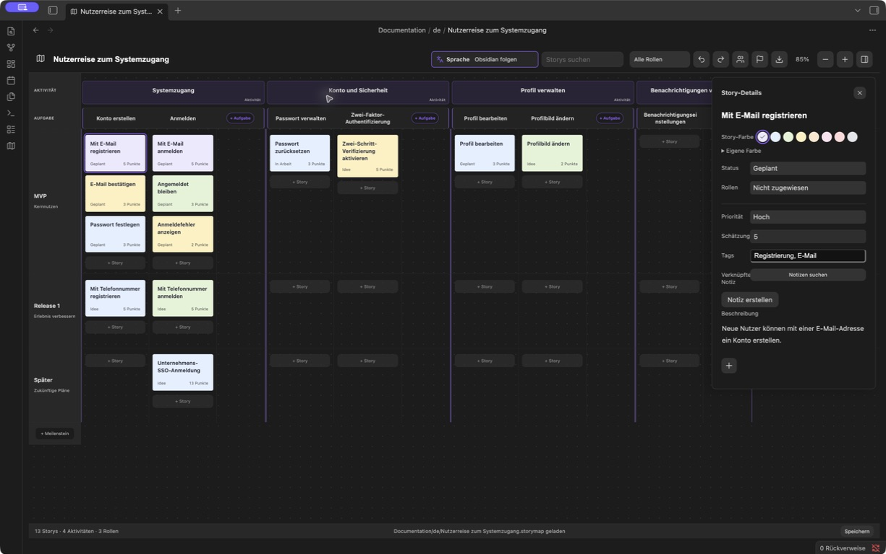
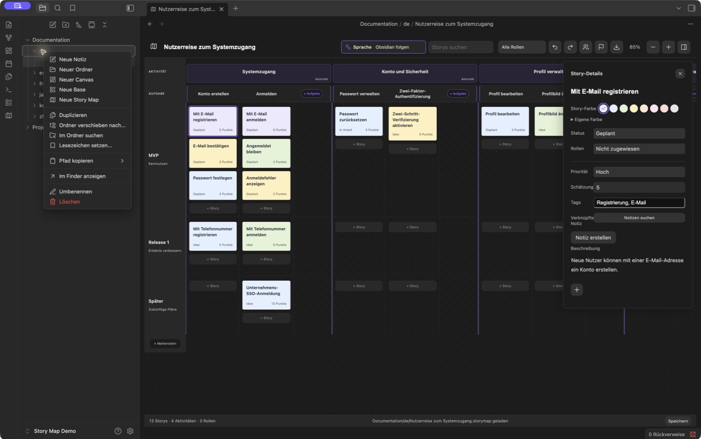
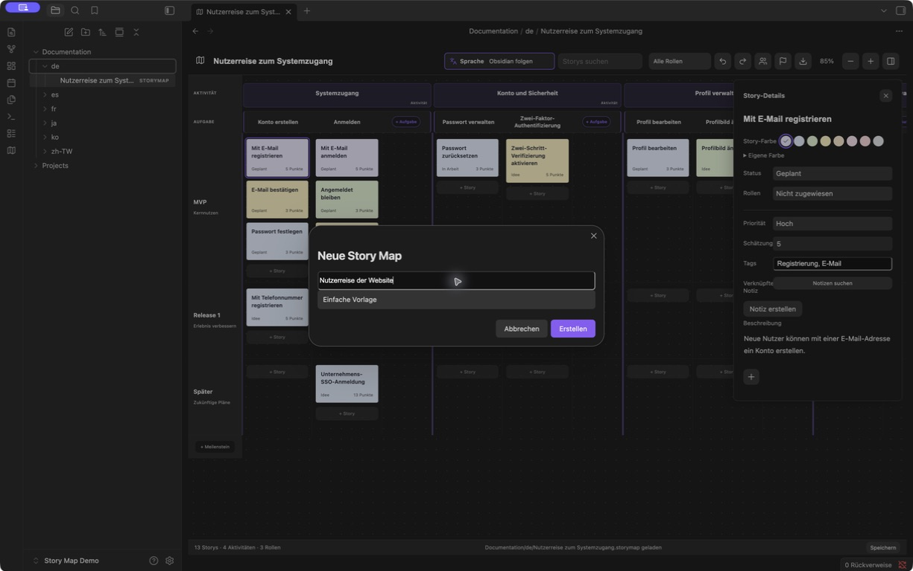

# Obsidian Story Map

[English](README.md) · [简体中文](README.zh-CN.md) · [繁體中文](README.zh-TW.md) · [日本語](README.ja.md) · [한국어](README.ko.md) · Deutsch · [Français](README.fr.md) · [Español](README.es.md)

**User Story Mapping für Menschen und Agenten – direkt in Obsidian.**

Erstelle einen gemeinsamen Produktplan: Bilde die Nutzerreise ab, unterteile sie in Aktivitäten und Aufgaben und ordne User Storys den Meilensteinen deiner Releases zu. Menschen arbeiten visuell; Agenten mit Dateizugriff auf den Vault können dieselben Maps zusammen mit den Projektnotizen lesen und bearbeiten.

**[1.5.1 herunterladen](https://github.com/prohui/obsidian-story-map/releases/tag/1.5.1)** · [Problem melden](https://github.com/prohui/obsidian-story-map/issues) · [MIT-Lizenz](LICENSE)

## Warum User Story Mapping in Obsidian?

User Story Mapping verbindet die geplante Arbeit mit der Nutzerreise. Aktivitäten und Aufgaben stehen nebeneinander; die Storys darunter sind in Meilenstein-Bahnen angeordnet. So wird der Umfang jedes Releases sichtbar.

In Obsidian liegt der Plan bei deinen Anforderungen, Recherchen und Implementierungsnotizen. Jede Map ist eine lokale `.storymap`-Datei mit JSON-Inhalt. Die visuelle Oberfläche und ein Agent mit Dateizugriff arbeiten am selben Plan, ohne ihn in ein anderes Planungstool zu kopieren.

## Mit einem Agenten arbeiten

Die Zusammenarbeit erfolgt über Dateien. Nutze einen eigenen Agenten und gewähre ihm Zugriff auf die relevanten Maps und Notizen. Story Map enthält keinen KI-Agenten, keine spezielle Agenten-API und keinen MCP-Server.

1. Erstelle eine Map und verknüpfe Storys mit den passenden Projektnotizen.
2. Bitte den Agenten, Map und Notizen zu lesen, Lücken zu finden und Storys oder Akzeptanzkriterien vorzuschlagen.
3. Prüfe die Vorschläge. Lass den Agenten anschließend die Datei bearbeiten und dabei Struktur, bestehende IDs, Beziehungen und nicht betroffene Inhalte erhalten.
4. Prüfe das Ergebnis in Obsidian und passe den Release-Umfang visuell an.

Beginne zum Beispiel mit einem reinen Leseauftrag:

> Lies `Projects/Website/Website journey.storymap` und die verknüpften Anforderungsnotizen. Schlage fehlende Storys und Akzeptanzkriterien für die Registrierung vor. Ändere noch keine Dateien.

Speichere vor der Übergabe und bearbeite dieselbe Map nicht gleichzeitig mit dem Agenten. Bei externen Änderungen an einer geöffneten `.storymap` lädt das Plugin die Datei neu, sofern keine lokalen Änderungen und keine geöffneten Detail-Editoren vorliegen. Andernfalls stoppt es das Speichern und bietet „Sichern und neu laden“ an. Gleichzeitige Änderungen werden nicht automatisch zusammengeführt. Der Agent muss Dateizugriff haben und das Map-Format korrekt erhalten können.

## Oberfläche

Plane auf der Map und bearbeite Details in einem kompakten Seitenbereich.



*Echter Screenshot aus Obsidian 1.13.7 mit Story Map 1.5.1. Oberfläche und Beispieldaten sind auf Deutsch; die Dateiseitenleiste ist ausgeblendet.*

- **Kompakte Story-Details:** Das Beschreibungsfeld wächst mit dem Text. Status, Rolle, Priorität, Schätzung, Tags und verknüpfte Notizen sind ohne Aufklappen weiterer Eigenschaften zugänglich.
- **Farben für Storys und Aufgaben:** Acht Vorgaben, Farbauswahl und HEX-Werte. Aufgaben können auch die Standardfarbe des Themes verwenden.
- **Sichtbare Sprachauswahl:** Symbol, Beschriftung und aktuelle Auswahl stehen zusammen in der Werkzeugleiste.
- **Beschreibungen und Anhänge:** Einfache Story-Beschreibungen und grundlegende Textformatierung für Aufgaben und Aktivitäten. Anhänge erscheinen als Bildvorschau oder kompakter Dateiname.

## Eine Map im Projektordner erstellen

1. Klicke im Datei-Explorer von Obsidian mit der rechten Maustaste auf den Zielordner und wähle **Neue Story Map**.



2. Gib einen Namen ein und wähle eine einfache Vorlage oder ein Beispiel. Beim Erstellen wird eine eigenständige `.storymap` im gewählten Ordner gespeichert, etwa `Projects/Website/Website journey.storymap`. Öffne sie wie andere Dateien im Datei-Explorer.



*Die Anleitungsbilder stammen aus einem Demo-Vault mit deutscher Oberfläche.*

Lege Aktivitäten für die Phasen der Nutzerreise an, unterteile sie in Aufgaben und füge Storys in den Meilenstein-Bahnen hinzu. Ein Klick auf eine Story öffnet ihre Details; ein Klick auf einen Aufgaben- oder Aktivitätstitel öffnet den Editor. Rollen und Meilensteine verwaltest du in der Werkzeugleiste. Meilensteine mit Storys lassen sich nicht löschen. Leere Aufgaben und Aktivitäten kannst du im Kontextmenü löschen.

## Funktionen

- Hierarchie aus Aktivität → Aufgabe → Story, mit Aufgabenspalten und Meilenstein-Bahnen.
- Eigener Bereich zum Hinzufügen von Aufgaben am Ende jeder Aktivität, ohne die Story-Spalten zu verengen.
- Storys per Drag-and-drop zwischen Aufgaben und Meilensteinen verschieben oder vor einer anderen Karte einsortieren.
- Rollen, Status, Priorität, Aufwandsschätzung, Tags und Verknüpfungen zu Markdown-Notizen.
- Überschriften, Fett- und Kursivschrift, Listen, Checklisten, Zitate, Links und Bilder in Aufgaben- und Aktivitätsbeschreibungen; Formatierungswerkzeuge erscheinen beim Bearbeiten.
- Dateien vom Computer oder aus dem Vault an Storys, Aufgaben und Aktivitäten anhängen.
- Suche, Rollenfilter, Zoom, Rückgängig/Wiederholen und Beibehaltung der Scrollposition.
- Mehrere eigenständige Maps in beliebigen Vault-Ordnern; ältere Formate werden weiter unterstützt.
- Englisch, vereinfachtes und traditionelles Chinesisch, Japanisch, Koreanisch, Deutsch, Französisch und Spanisch.
- Export als PNG, PDF, XMind oder JSON; Speicherstatus, Wiederholungsversuche und Schutz vor dem Überschreiben nicht lesbarer Daten.

## Installation und Updates

Benötigt Obsidian 1.8.10 oder neuer.

1. Lade `main.js`, `manifest.json` und `styles.css` aus den [Releases](https://github.com/prohui/obsidian-story-map/releases/latest) herunter.
2. Lege sie im Vault unter `.obsidian/plugins/story-map/` ab.
3. Aktiviere **Story Map** unter Einstellungen → Community-Plugins.
4. Klicke auf das Map-Symbol in der Seitenleiste oder führe **Story Map öffnen** in der Befehlspalette aus.

Ersetze zum Aktualisieren diese drei Dateien und deaktiviere und aktiviere das Plugin anschließend erneut. Map-Daten liegen außerhalb des Plugin-Ordners. Der Eintrag ist auch im [Obsidian-Community-Verzeichnis](https://community.obsidian.md/plugins/story-map) verfügbar.

## Beschreibungen, Farben und Dateien

**Storys:** Klicke auf eine Karte, um ihre Details zu bearbeiten. Mit **+** unter der Beschreibung importierst du eine Datei vom Computer oder wählst eine vorhandene Vault-Datei. Nutze die Farbfelder oder die benutzerdefinierte Farbauswahl mit HEX-Eingabe.

**Aufgaben und Aktivitäten:** Klicke auf den Titel und ergänze formatierten Text oder eingebettete Bilder. Füge Dateien durch Einfügen, Ziehen oder über **+** hinzu. Speichere mit der Schaltfläche oder **Cmd/Ctrl + Enter**. Für Aufgaben stehen acht Farbvorlagen und eigene HEX-Werte bereit.

Importierte Anhänge von Aufgaben und Aktivitäten werden sofort gemäß den Obsidian-Einstellungen für Anhänge gespeichert. Abbrechen oder Entfernen einer Referenz löscht die importierte Datei nicht. Story-Anhänge werden beim Speichern geschrieben. Sichere Anhänge gemeinsam mit den Maps: JSON- und XMind-Exporte enthalten nur Referenzen, keine Kopien der Dateien.

## Sprache

Wähle im Sprachmenü der Werkzeugleiste die automatische Übernahme aus Obsidian oder eine bestimmte Sprache. Die Änderung gilt sofort und bleibt nach erneutem Laden erhalten.

Nur die Oberfläche wird umgestellt. Bestehende Titel, Beschreibungen, Rollennamen und andere eigene Inhalte bleiben unverändert. Neue Beispiel-Maps verwenden die gewählte Sprache. Nicht unterstützte Obsidian-Sprachen fallen auf Englisch zurück; traditionelles Chinesisch wird getrennt erkannt.

## Export

Klicke auf das Export-Symbol, wähle das Format und lege im Systemdialog Dateiname und Speicherort fest.

| Format | Ergebnis |
| --- | --- |
| PNG | Vollständige Map als Bild mit hellem Layout, ohne Bedienelemente und Detailbereich. |
| PDF | Die gesamte Map als Bild auf einer Seite; Text ist nicht durchsuchbar. |
| XMind | Bearbeitbare Zweige für Nutzerreise, Release-Plan und Rollen; Beschreibungen und Dateireferenzen stehen in den Themennotizen. |
| JSON | Sicherung der Map-Daten einschließlich Beschreibungen und Anhangreferenzen; eine JSON-Importoberfläche gibt es noch nicht. |

Suche, Filter und Zoom schränken den Export nicht ein. Für Maps jenseits der Größenbegrenzung des Bildexports verwende XMind oder JSON. Abbrechen im Speicherdialog schreibt keine Datei. Ist der Systemdialog nicht verfügbar, wird in einen sprachabhängigen Vault-Ordner wie `Story Map Exporte/` exportiert. Nummerierte Dateinamen schützen vorhandene Dateien. Fehlgeschlagene Exporte können wiederholt werden.

## Daten und Kompatibilität

- Jede `.storymap` enthält JSON und kann überall im Vault liegen. `.story-map.json` und `.story-maps/` aus älteren Versionen werden weiter unterstützt.
- Beschreibungen verwenden Markdown. Verknüpfte Notizen bleiben normale Markdown-Dateien, die ohne Plugin lesbar sind.
- Das Plugin selbst stellt keine Netzwerkanfragen. Nimm Maps, Notizen und Anhänge in deine Sicherungen auf.
- Solange das Plugin aktiv ist, aktualisieren Umbenennungen von Notizen und Ordnern die Map-Links und unterstützten Anhangreferenzen.
- Der Rückgängig-Verlauf gilt für die aktuelle Sitzung und umfasst bis zu 50 Schritte. Synchronisiere vor dem Bearbeiten auf einem anderen Gerät. Externe Änderungen werden erkannt; gleichzeitige Änderungen werden nicht automatisch zusammengeführt.
- Lass das Plugin bei Speicherfehlern geöffnet, behebe Probleme mit Datenträger oder Berechtigungen und versuche es erneut. Repariere bei Lesefehlern die Map-Datei vor dem erneuten Laden.

## Entwicklung

Mit Node.js 22:

```sh
npm ci
npm test
```

Die Tests prüfen Obsidian-Lint-Regeln, TypeScript, Produktionsbuild, Persistenz, Sprachen, Farben, Textformatierung, Anhänge und Exporte. `npm run dev` beobachtet Änderungen. Kopiere die gebauten Plugin-Dateien zum Ausprobieren in einen Test-Vault.

Oberflächentexte liegen in `src/i18n.ts` und `src/locales.ts`, Editortexte in `src/editor-labels.ts` und `src/editor-locales.ts`, Beispieldaten in `src/sample.ts`. Die englische `README.md` ist die Referenz; halte `README.en.md` identisch und aktualisiere die Übersetzungen bei Funktionsänderungen.

Beiträge und Übersetzungen sind willkommen. Gib bei Fehlermeldungen die Obsidian-Version, Schritte zum Nachstellen und ein Beispiel ohne private Daten an.

## Entwicklung unterstützen

Wenn Story Map dir hilft, kannst du die Wartung und Weiterentwicklung [auf Ko-fi unterstützen](https://ko-fi.com/hexhe). Die Unterstützung ist freiwillig und schaltet keine Funktionen frei oder ab.

## Lizenz

[MIT](LICENSE) © 2026 Dahui. Keine Verbindung zu Obsidian, Miro oder XMind.
