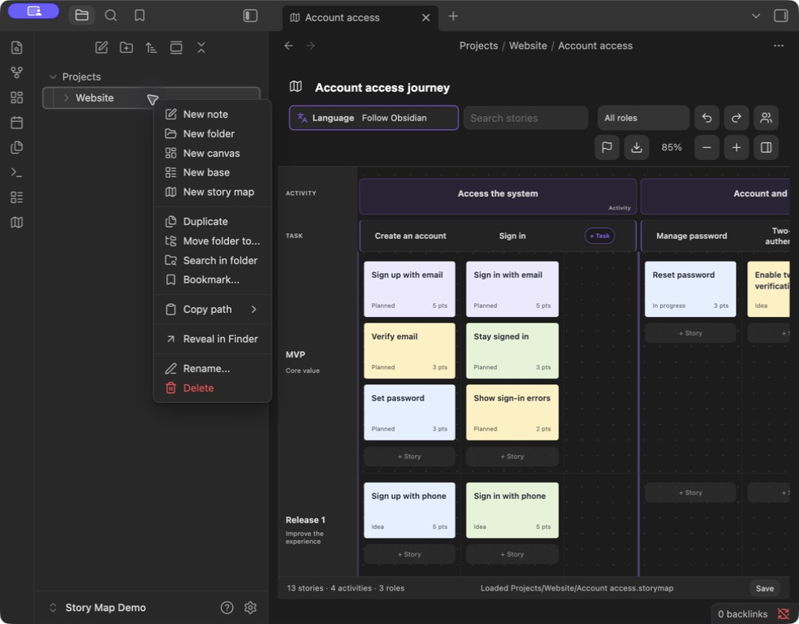
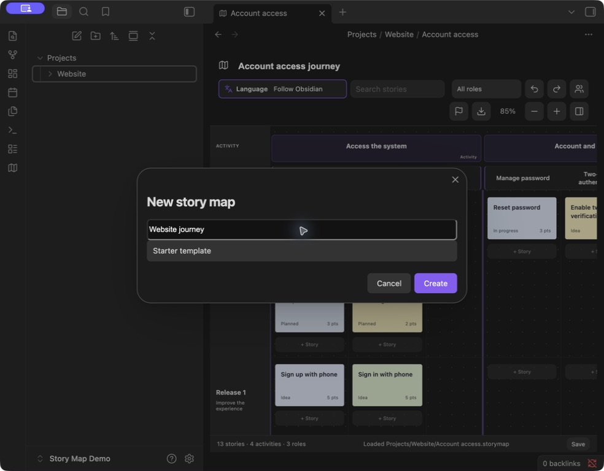

# Obsidian Story Map

English · [简体中文](README.zh-CN.md) · [繁體中文](README.zh-TW.md) · [日本語](README.ja.md) · [한국어](README.ko.md) · [Deutsch](README.de.md) · [Français](README.fr.md) · [Español](README.es.md)

**User story mapping for humans and agents, inside Obsidian.**

Build a shared product plan: map the user journey, break it into activities and tasks, and organize user stories into release milestones. People work visually; agents with access to your vault can read and edit the underlying map files alongside your project notes.

**[Download 1.5.1](https://github.com/prohui/obsidian-story-map/releases/tag/1.5.1)** · [Report an issue](https://github.com/prohui/obsidian-story-map/issues) · [MIT License](LICENSE)

## Why user story mapping in Obsidian?

User story mapping connects the work you plan to the journey a user takes. Activities and tasks run horizontally across the map; stories sit beneath them in milestone lanes, making the scope of each release visible.

Obsidian puts this plan in the same workspace as your requirements, research, and implementation notes. Each map is a local `.storymap` file containing JSON. The visual interface and a file-capable agent can work with the same plan, without copying it into a separate planning tool.

## Working with an agent

The integration is file-based. Bring your own agent and give it access to the relevant map and notes; Story Map does not include an AI agent, an agent API, or an MCP server.

A suggested workflow:

1. Create a map and link stories to relevant project notes.
2. Ask your agent to read the map and those notes, identify gaps, and propose stories or acceptance criteria.
3. Review the proposal, then have the agent update the file while preserving its structure, existing IDs, relationships, and unrelated content.
4. Review the updated plan in Obsidian and adjust its release scope visually.

For example, start with a read-only request:

> Read `Projects/Website/Website journey.storymap` and its linked requirements notes. Identify missing stories in the sign-up journey and propose acceptance criteria. Do not change any files yet.

Save your edits before handing the file to an agent, and avoid editing the same map simultaneously. The plugin detects external changes to open `.storymap` files and reloads them when there are no local changes or active detail editors. If edits conflict or a detail editor is open, it stops saving and offers a backup-and-reload flow; it does not automatically merge concurrent edits. This workflow depends on your agent's file access and ability to preserve the map format.

## Interface

Plan on the map and edit details in a compact side panel. The screenshots show the current interface and the instructions below explain how to create a map in your project folder.


*Actual Obsidian 1.13.7 screenshot with sample data. The file sidebar is hidden to keep the focus on the map.*

- **Compact Story details.** Descriptions grow with their text. Status, role, priority, estimate, tags, and linked notes are directly accessible without expanding “More properties.”
- **Colors for Stories and Tasks.** Small swatches offer eight presets; Custom color accepts a color-picker choice or HEX value. Task colors can also return to the theme default.
- **A visible language control.** The toolbar groups a language icon, a label, and the current selection. Choose Follow Obsidian or one of eight languages.
- **Lightweight editing and attachments.** Story descriptions stay simple. Task and Activity descriptions provide basic rich-text editing; attachments appear as image thumbnails or compact filename chips.

## Create a map where your project lives

Right-click a folder in Obsidian's file explorer and choose **New story map**. Enter a name and choose a starter template or sample. The plugin creates an independent `.storymap` file in that folder. Open it from the file explorer like other vault files.

**1. Right-click the destination folder → New story map.** You can create a map in any vault folder.



**2. Enter a map name, choose a starter template or sample, and click Create.** The map is saved inside the selected folder—for example, `Projects/Website/Website journey.storymap`.



*Captured in an English-language demo vault.*

Name the map, add activities for journey stages, break each activity into tasks, and add stories within milestone lanes. Click a Story for its details; click a Task or Activity title to open its editor. Manage roles and milestones from the toolbar. Milestones containing stories cannot be deleted; empty tasks and activities can be deleted from their context menus.

## Features

- Activity → Task → Story hierarchy, with tasks arranged across columns and stories grouped into milestone lanes.
- Add tasks in a dedicated space at the end of each activity, without squeezing the story columns.
- Drag stories between tasks and milestones or before another card to reorder them.
- Assign roles, set status and priority, estimate effort, add tags, and link stories to Markdown notes.
- Edit Task and Activity descriptions with headings, bold, italic, lists, checklists, quotes, links, and images. Formatting controls appear while editing.
- Attach local or existing vault files to Stories, Tasks, and Activities.
- Search, role filters, zoom, undo/redo, and preserved scroll position.
- Create multiple independent `.storymap` files in any vault folder; older map formats remain supported.
- Eight interface languages: English, Simplified Chinese, Traditional Chinese, Japanese, Korean, German, French, and Spanish.
- Export PNG, PDF, XMind, or JSON, with save status, retry, and protection against overwriting unreadable map data.

## Install or update

Requires Obsidian 1.8.10 or newer.

1. Download `main.js`, `manifest.json`, and `styles.css` from [Releases](https://github.com/prohui/obsidian-story-map/releases/latest).
2. Place them in `.obsidian/plugins/story-map/` inside your vault.
3. Enable **Story Map** in Obsidian → Settings → Community plugins.
4. Click the map ribbon icon or run **Open Story Map** from the command palette.

To update, replace those three files, then disable and re-enable the plugin. Map data is stored outside the plugin folder. The [Obsidian community page](https://community.obsidian.md/plugins/story-map) provides the community listing entry point.

## Descriptions, colors, and files

**Stories:** click a card to edit its compact details. Use the **+** below the description to import a file from your computer or select an existing vault file. Use the small Story color swatches or expand **Custom color** for a picker and HEX input.

**Tasks and Activities:** click the title to open the description editor. Use basic formatting and inline images to explain the work and its references. Paste or drag in images and files, or use **+** to add an attachment. Click **Save**, or press **Cmd/Ctrl + Enter**. Task colors are available in the Task editor; choose from eight presets or enter a custom HEX color.

Imported Task and Activity attachments are saved immediately using Obsidian's attachment-location settings. Cancelling editing or removing a reference does not delete an imported file. Story imports are written when saved. Back up attachment files along with your maps: JSON and XMind exports contain references, not copies of the attached files.

## Language

Use the toolbar language menu; look for the icon and visible **Language** label. Choose **Follow Obsidian** or select a language manually. Changes apply immediately and persist across reloads.

Interface labels change, while existing titles, descriptions, role names, and other user content keep their original language. Fresh sample maps use the selected language. Unsupported host languages fall back to English; Traditional Chinese locales are detected separately.

## Export

Click the export icon, choose a format, then select the filename and location in the system Save As dialog.

| Format | Output |
| --- | --- |
| PNG | Full-map image in a clean light layout, without controls or the details panel. |
| PDF | The full-map image on one page; text is not searchable. |
| XMind | Editable User journey, Release plan, and Roles branches, with descriptions and file references in topic notes. |
| JSON | Map data backup, including descriptions and attachment references; there is no JSON import interface yet. |

Search, filters, and zoom do not limit the exported data. Very large maps beyond the visual export limit can use XMind or JSON. Cancelling the Save As dialog writes nothing. If the system picker is unavailable, exports go to a localized vault folder such as `Story Map Exports/`, using numbered filenames to preserve existing files. Failed exports can be retried.

## Data and compatibility

- Each `.storymap` file contains JSON and can live anywhere in the vault. Legacy `.story-map.json` and `.story-maps/` maps remain supported.
- Descriptions use Markdown. Linked notes remain normal Markdown files that can be read without the plugin.
- The plugin makes no network requests of its own. Include map files, notes, and attachments in your vault backups.
- While the plugin is enabled, note and folder renames update map links and supported attachment references.
- Undo history lasts for the current session, up to 50 steps. Sync before editing on another device. External changes to independent maps are detected with backup-and-reload recovery; simultaneous edits are not automatically merged.
- If saving fails, keep the plugin open, resolve the disk or permission problem, and retry Save. If loading fails, repair the map file before reloading.

## Development

With Node.js 22:

```sh
npm ci
npm test
```

Tests include Obsidian lint rules, TypeScript checks, production bundling, persistence, localization, colors, rich-text editing, attachments, and exports. `npm run dev` watches for changes. Copy the built plugin files into a test vault to run it.

Interface translations are in `src/i18n.ts` and `src/locales.ts`; editor translations are in `src/editor-labels.ts` and `src/editor-locales.ts`. Sample content is localized separately in `src/sample.ts`. Use this English `README.md` as the documentation reference and keep `README.en.md` identical. When features change, update the corresponding sections in all eight language editions. Each language edition uses screenshots of the matching Obsidian interface, plugin interface, and sample map content. Keep screenshots and captions in sync when the interface changes.

Contributions and translations are welcome. When reporting an issue, include your Obsidian version, reproduction steps, and an example without private data.

## Support development

If Story Map helps you plan your projects, you can [buy me a coffee](https://ko-fi.com/hexhe) to support maintenance, bug fixes, and improvements. Support is entirely optional and does not unlock or restrict any features.

## License

[MIT](LICENSE) © 2026 Dahui. Not affiliated with Obsidian, Miro, or XMind.
