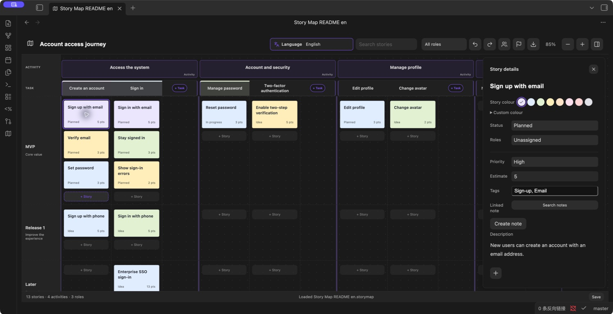

# Obsidian Story Map

English · [简体中文](README.md)

Plan user journeys, organize stories, and define release milestones inside Obsidian. Keep your map in your vault, link stories to Markdown notes, and export to XMind.

**[Download 1.0.4](https://github.com/prohui/obsidian-story-map/releases/tag/1.0.4)** · [Report an issue](https://github.com/prohui/obsidian-story-map/issues) · [MIT License](LICENSE)



*Captured in Obsidian 1.13.7 using sample data. The English UI preserves the original language of story content.*

## Features

- Activity → Task → Story hierarchy with task columns and milestone lanes.
- Add activities/tasks at the end of their groups; add stories below existing cards. Double-click to edit.
- Create, edit, or delete roles. Each story can have one role or remain unassigned.
- Manage milestones. Milestones containing stories cannot be deleted; empty tasks and activities can be deleted from the context menu.
- Drag stories between tasks and milestones or before another card to reorder them.
- Floating details: status, priority, estimate, tags, description, and linked Markdown notes.
- Search, role filters, zoom, undo/redo, and preserved scroll position.
- English and Simplified Chinese interface, with automatic Obsidian language detection or manual selection.
- XMind export with User journey, Release plan, and Roles branches. Story details appear in topic notes.
- Local saving with status, retry, and protection against overwriting unreadable data.

## Install

Requires Obsidian 1.8.10 or newer.

1. Download `main.js`, `manifest.json`, and `styles.css` individually from [Releases](https://github.com/prohui/obsidian-story-map/releases/latest).
2. Create `.obsidian/plugins/story-map/` in your vault and place the three files there.
3. Enable Story Map in Obsidian's community plugin settings.
4. Click the map ribbon icon or run the Open Story Map command.

To update, replace the files and disable/re-enable the plugin. Map data is stored outside the plugin folder. Visit the [Obsidian community listing](https://community.obsidian.md/plugins/story-map) for the current review status and installation entry point.

## Use and language

Name the map, add activities, break them into tasks, and add stories within milestone lanes. Click a story to edit details or link a note. Manage roles and assign one to each story as needed. Drag cards to change their ordering or release scope.

The toolbar language selector supports Follow Obsidian, 简体中文, and English. Changes take effect immediately and persist across reloads. Unsupported host languages fall back to English. User content, including sample content, retains its original language.

Exported `.xmind` files go to `Story Map Exports/` in English or `故事地图导出/` in Chinese. Existing exports are preserved by numbering new files.

## Data and compatibility

- One map per vault, stored in `.story-map.json` at the vault root. Include it in backups.
- The plugin makes no network requests. Linked Markdown notes remain readable without it.
- Undo history lasts for the current session, up to 50 steps. Sync before editing on another device; simultaneous editing conflict resolution is not provided.
- If saving fails, keep the plugin open, resolve disk/permission problems, and click Save. If loading fails, repair the map file and reload the plugin.
- Release acceptance: macOS, Obsidian 1.8.10, XMind 26.04.01337. Desktop/narrow layouts, both languages, core editing flows, persistence, and opening exports were checked. Saving and reopening in XMind were also tested.

## Development

With Node.js 22:

```sh
npm ci
npm test
```

Tests include official Obsidian lint rules, TypeScript checks, production bundling, persistence regression tests, localization, and XMind structure checks. `npm run lint` runs the guidelines check separately. `npm run dev` watches for changes. Copy the built plugin files into a test vault to run it.

Translations are centralized in `src/i18n.ts`. User values are interpolated without modification. Contributions and additional translations are welcome. Include your Obsidian version, reproduction steps, and a non-private example when reporting an issue.

## License

[MIT](LICENSE) © 2026 Dahui. Not affiliated with Obsidian, Miro, or XMind.
