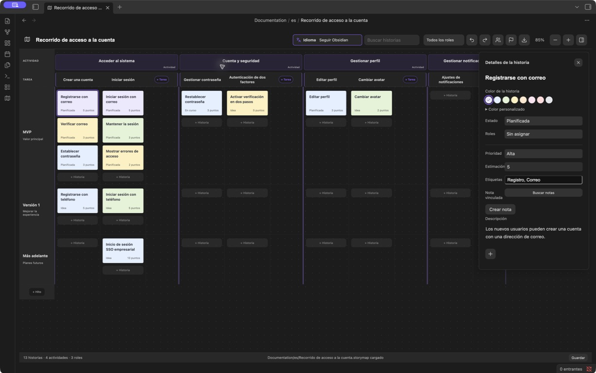
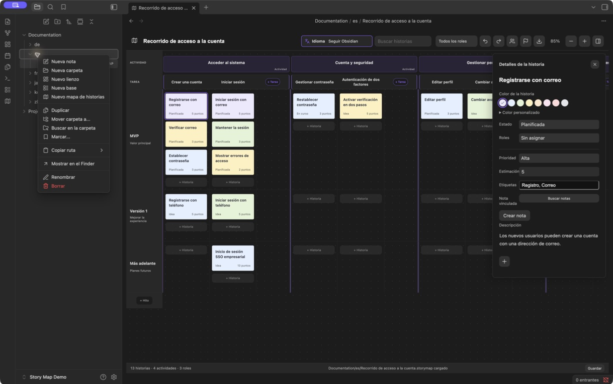
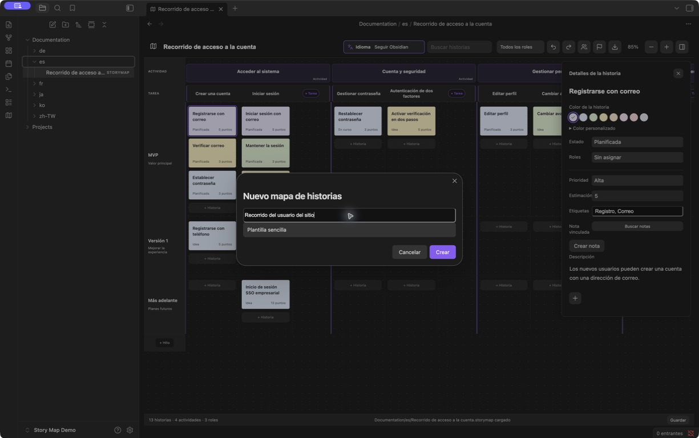

# Obsidian Story Map

[English](README.md) · [简体中文](README.zh-CN.md) · [繁體中文](README.zh-TW.md) · [日本語](README.ja.md) · [한국어](README.ko.md) · [Deutsch](README.de.md) · [Français](README.fr.md) · Español

**Mapas de historias de usuario para personas y agentes, dentro de Obsidian.**

Crea un plan de producto compartido: representa el recorrido del usuario, divídelo en actividades y tareas, y organiza las historias de usuario por hitos de entrega. Las personas trabajan de forma visual; los agentes con acceso a los archivos de la bóveda pueden leer y editar los mismos mapas junto con las notas del proyecto.

**[Descargar 1.5.1](https://github.com/prohui/obsidian-story-map/releases/tag/1.5.1)** · [Informar de un problema](https://github.com/prohui/obsidian-story-map/issues) · [Licencia MIT](LICENSE)

## ¿Por qué crear mapas de historias en Obsidian?

El mapeo de historias de usuario conecta el trabajo previsto con el recorrido del usuario. Las actividades y tareas se disponen horizontalmente; las historias se colocan debajo, en carriles por hito, para mostrar el alcance de cada entrega.

En Obsidian, el plan comparte espacio con los requisitos, la investigación y las notas de implementación. Cada mapa es un archivo local `.storymap` que contiene JSON. La interfaz visual y un agente capaz de trabajar con archivos pueden usar el mismo plan sin copiarlo a otra herramienta.

## Trabajar con un agente

La integración se realiza mediante archivos. Utiliza tu propio agente y dale acceso a los mapas y notas pertinentes. Story Map no incluye un agente de IA, una API específica para agentes ni un servidor MCP.

1. Crea un mapa y vincula las historias con las notas relevantes del proyecto.
2. Pide al agente que lea el mapa y las notas, detecte carencias y proponga historias o criterios de aceptación.
3. Revisa las propuestas y después pídele que actualice el archivo conservando la estructura, los identificadores existentes, las relaciones y el contenido ajeno al cambio.
4. Comprueba el resultado en Obsidian y ajusta visualmente el alcance de la entrega.

Puedes empezar con una petición de solo lectura:

> Lee `Projects/Website/Website journey.storymap` y las notas de requisitos vinculadas. Propón las historias que faltan en el recorrido de registro y sus criterios de aceptación. No modifiques ningún archivo todavía.

Guarda los cambios antes de pasar el archivo al agente y evita editar el mismo mapa a la vez. Si un `.storymap` abierto cambia externamente, el complemento lo recarga cuando no hay cambios locales ni editores de detalles abiertos. En caso contrario, detiene el guardado y ofrece respaldar y recargar. No combina automáticamente las ediciones simultáneas. Este flujo depende del acceso del agente a los archivos y de su capacidad para conservar el formato del mapa.

## Interfaz

Planifica en el mapa y edita los detalles en un panel lateral compacto.



*Captura real de Obsidian 1.13.7 con Story Map 1.5.1. La interfaz y los datos de ejemplo están en español; la barra lateral de archivos está oculta.*

- **Detalles compactos.** La descripción crece con el texto. Estado, rol, prioridad, estimación, etiquetas y notas vinculadas se editan sin desplegar más propiedades.
- **Colores de historias y tareas.** Ocho colores predefinidos, selector de color y valores HEX. Las tareas también pueden recuperar el color predeterminado del tema.
- **Selector de idioma visible.** La barra de herramientas reúne el icono, la etiqueta y la selección actual.
- **Descripciones y adjuntos.** Las historias mantienen una descripción sencilla; las tareas y actividades admiten formato básico. Los adjuntos aparecen como miniaturas o nombres de archivo compactos.

## Crear un mapa en la carpeta del proyecto

1. Haz clic derecho en la carpeta de destino dentro del explorador de archivos de Obsidian y elige **Nuevo mapa de historias**.



2. Introduce un nombre, elige una plantilla sencilla o un ejemplo y crea el mapa. Se guarda un archivo `.storymap` independiente en esa carpeta, por ejemplo `Projects/Website/Website journey.storymap`. Ábrelo desde el explorador como cualquier otro archivo.



*Las imágenes de los pasos se tomaron en una bóveda de demostración con la interfaz en español.*

Define actividades para las etapas del recorrido, divídelas en tareas y coloca las historias en los carriles de hitos. Haz clic en una historia para ver sus detalles o en el título de una tarea o actividad para abrir su editor. Gestiona roles e hitos desde la barra de herramientas. Los hitos con historias no se pueden eliminar. Las tareas y actividades vacías se pueden eliminar desde el menú contextual.

## Funciones

- Jerarquía actividad → tarea → historia, con columnas de tareas y carriles por hito.
- Espacio propio para añadir tareas al final de cada actividad, sin estrechar las columnas de historias.
- Arrastra historias entre tareas e hitos o colócalas delante de otra tarjeta para reordenarlas.
- Asigna roles, estados, prioridades, estimaciones y etiquetas, y vincula notas Markdown.
- Usa títulos, negrita, cursiva, listas, listas de verificación, citas, enlaces e imágenes en las descripciones de tareas y actividades; los controles de formato aparecen al editar.
- Adjunta archivos del ordenador o de la bóveda a historias, tareas y actividades.
- Búsqueda, filtros por rol, zoom, deshacer/rehacer y conservación de la posición de desplazamiento.
- Varios mapas independientes en cualquier carpeta de la bóveda, con compatibilidad con formatos anteriores.
- Inglés, chino simplificado y tradicional, japonés, coreano, alemán, francés y español.
- Exportación a PNG, PDF, XMind y JSON; estado de guardado, reintentos y protección contra sobrescribir datos que no se pueden leer.

## Instalación y actualización

Requiere Obsidian 1.8.10 o posterior.

1. Descarga `main.js`, `manifest.json` y `styles.css` desde [Releases](https://github.com/prohui/obsidian-story-map/releases/latest).
2. Colócalos en `.obsidian/plugins/story-map/` dentro de tu bóveda.
3. Activa **Story Map** en los ajustes de complementos de la comunidad de Obsidian.
4. Pulsa el icono de mapa de la barra lateral o ejecuta **Abrir Story Map** desde la paleta de comandos.

Para actualizar, sustituye esos tres archivos y desactiva y vuelve a activar el complemento. Los datos de los mapas se guardan fuera de la carpeta del complemento. También puedes consultar la [ficha en la comunidad de Obsidian](https://community.obsidian.md/plugins/story-map).

## Descripciones, colores y archivos

**Historias:** haz clic en una tarjeta para editar sus detalles. Usa **+** debajo de la descripción para importar un archivo del ordenador o elegir uno de la bóveda. Puedes usar las muestras de color o el selector personalizado con entrada HEX.

**Tareas y actividades:** pulsa el título para editar la descripción con formato e imágenes integradas. Pega o arrastra archivos, o añádelos con **+**. Guarda con el botón correspondiente o **Cmd/Ctrl + Enter**. Las tareas admiten ocho colores predefinidos y un valor HEX personalizado.

Los adjuntos importados en tareas y actividades se guardan inmediatamente según los ajustes de ubicación de Obsidian. Cancelar la edición o quitar una referencia no elimina el archivo importado. Los archivos de las historias se escriben al guardar. Incluye los adjuntos en tus copias de seguridad: las exportaciones JSON y XMind contienen referencias, no copias de los archivos.

## Idioma

En el menú de idioma de la barra de herramientas, elige seguir el idioma de Obsidian o selecciona uno manualmente. El cambio se aplica al instante y se conserva tras recargar.

Solo cambian las etiquetas de la interfaz. Los títulos, descripciones, nombres de roles y demás contenido existente no se traducen. Los mapas de ejemplo nuevos usan el idioma seleccionado. Los idiomas de Obsidian no compatibles recurren al inglés; el chino tradicional se detecta por separado.

## Exportación

Pulsa el icono de exportación, elige un formato y selecciona el nombre y la ubicación en el diálogo de guardado del sistema.

| Formato | Resultado |
| --- | --- |
| PNG | Imagen del mapa completo con diseño claro, sin controles ni panel de detalles. |
| PDF | Imagen del mapa completo en una página; no permite buscar texto. |
| XMind | Ramas editables de recorrido del usuario, plan de entregas y roles; las descripciones y referencias a archivos se guardan en las notas de los temas. |
| JSON | Copia de los datos del mapa, con descripciones y referencias a adjuntos; todavía no hay interfaz de importación JSON. |

La búsqueda, los filtros y el zoom no limitan los datos exportados. Usa XMind o JSON para mapas que superen el límite de seguridad de la exportación de imágenes. Cancelar el diálogo no escribe ningún archivo. Si el selector del sistema no está disponible, se exporta a una carpeta de la bóveda adaptada al idioma, como `Exportaciones Story Map/`. Los nombres se numeran para conservar archivos existentes. Las exportaciones fallidas se pueden reintentar.

## Datos y compatibilidad

- Cada `.storymap` contiene JSON y puede guardarse en cualquier lugar de la bóveda. Los formatos anteriores `.story-map.json` y `.story-maps/` siguen siendo compatibles.
- Las descripciones usan Markdown. Las notas vinculadas son archivos Markdown normales y se pueden leer sin el complemento.
- El complemento no realiza solicitudes de red por sí mismo. Incluye mapas, notas y adjuntos en tus copias de seguridad.
- Mientras el complemento esté activo, renombrar notas o carpetas actualiza los enlaces del mapa y las referencias a adjuntos compatibles.
- El historial de deshacer dura la sesión actual, con un máximo de 50 pasos. Sincroniza antes de editar en otro dispositivo. Se detectan cambios externos, pero no se combinan automáticamente ediciones simultáneas.
- Si falla el guardado, mantén el complemento abierto, resuelve los problemas de disco o permisos y vuelve a intentarlo. Si falla la lectura, repara el archivo del mapa antes de recargarlo.

## Desarrollo

Con Node.js 22:

```sh
npm ci
npm test
```

Las pruebas cubren reglas lint de Obsidian, TypeScript, compilación de producción, persistencia, idiomas, colores, texto enriquecido, adjuntos y exportaciones. `npm run dev` vigila los cambios. Copia los archivos compilados a una bóveda de prueba para ejecutar el complemento.

Las traducciones de la interfaz están en `src/i18n.ts` y `src/locales.ts`; las de los editores, en `src/editor-labels.ts` y `src/editor-locales.ts`; y los ejemplos, en `src/sample.ts`. El `README.md` en inglés es la referencia. Mantén `README.en.md` idéntico y actualiza las traducciones cuando cambien las funciones.

Las contribuciones y traducciones son bienvenidas. Al informar de un problema, incluye la versión de Obsidian, los pasos para reproducirlo y un ejemplo sin datos privados.

## Apoyar el desarrollo

Si Story Map te resulta útil, puedes [apoyar su desarrollo en Ko-fi](https://ko-fi.com/hexhe) para contribuir al mantenimiento, las correcciones y las mejoras. El apoyo es voluntario y no desbloquea ni restringe ninguna función.

## Licencia

[MIT](LICENSE) © 2026 Dahui. Sin afiliación con Obsidian, Miro ni XMind.
