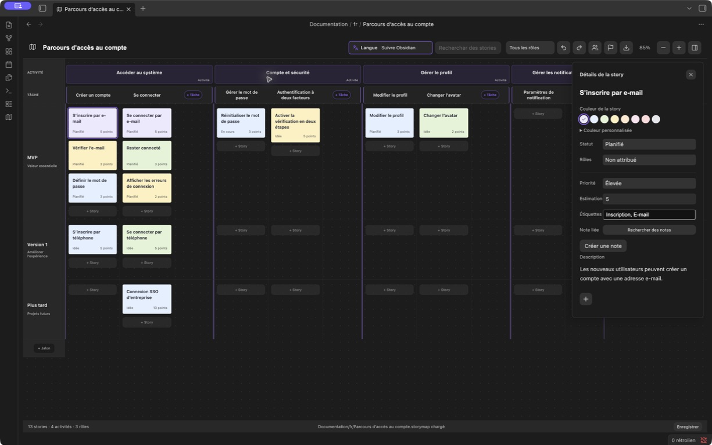
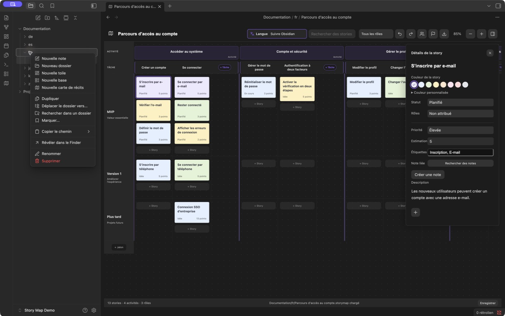
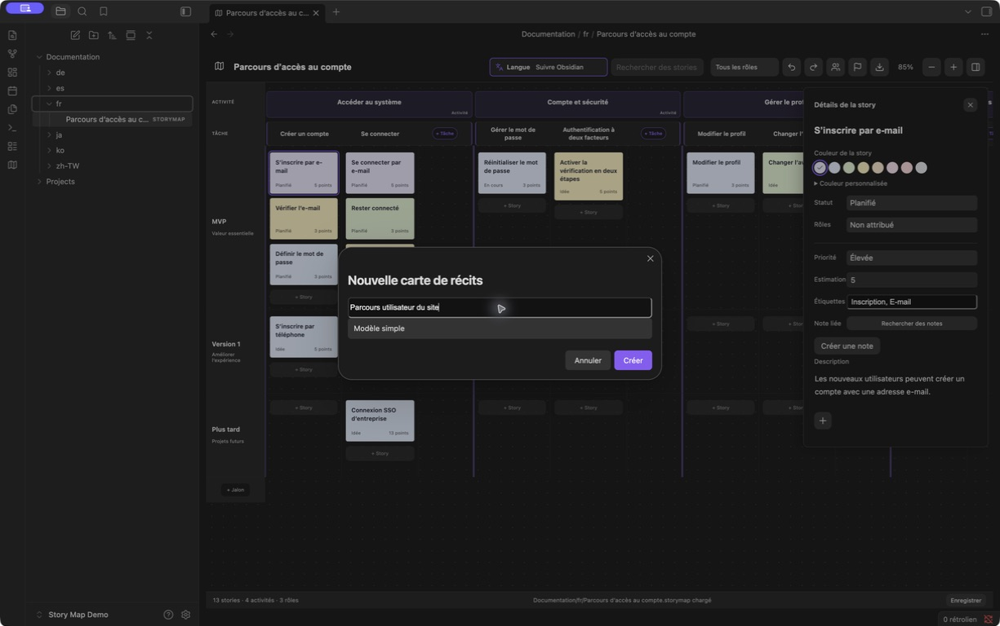

# Obsidian Story Map

[English](README.md) · [简体中文](README.zh-CN.md) · [繁體中文](README.zh-TW.md) · [日本語](README.ja.md) · [한국어](README.ko.md) · [Deutsch](README.de.md) · Français · [Español](README.es.md)

**Le user story mapping pour les personnes et les agents, dans Obsidian.**

Construisez un plan produit commun : représentez le parcours utilisateur, décomposez-le en activités et en tâches, puis répartissez les user stories entre les jalons de livraison. Vous travaillez visuellement ; les agents ayant accès aux fichiers du coffre peuvent lire et modifier les mêmes cartes avec vos notes de projet.

**[Télécharger la version 1.5.1](https://github.com/prohui/obsidian-story-map/releases/tag/1.5.1)** · [Signaler un problème](https://github.com/prohui/obsidian-story-map/issues) · [Licence MIT](LICENSE)

## Pourquoi utiliser le story mapping dans Obsidian ?

Le user story mapping relie le travail prévu au parcours utilisateur. Les activités et les tâches s'alignent horizontalement ; les stories se placent dessous, dans des couloirs par jalon. Le périmètre de chaque livraison devient ainsi visible.

Dans Obsidian, ce plan reste à côté des exigences, des recherches et des notes de réalisation. Chaque carte est un fichier local `.storymap` contenant du JSON. L'interface visuelle et un agent capable de manipuler des fichiers peuvent travailler sur le même plan, sans le recopier dans un autre outil.

## Travailler avec un agent

La collaboration passe par les fichiers. Utilisez votre propre agent et donnez-lui accès aux cartes et aux notes concernées. Story Map n'intègre ni agent d'IA, ni API dédiée aux agents, ni serveur MCP.

1. Créez une carte et liez les stories aux notes de projet pertinentes.
2. Demandez à l'agent de lire la carte et les notes, de repérer les manques et de proposer des stories ou des critères d'acceptation.
3. Examinez ses propositions, puis faites-lui modifier le fichier en conservant la structure, les identifiants existants, les relations et le contenu non concerné.
4. Vérifiez le résultat dans Obsidian et ajustez visuellement le périmètre de livraison.

Vous pouvez commencer par une demande en lecture seule :

> Lis `Projects/Website/Website journey.storymap` et les notes d'exigences liées. Propose les stories manquantes dans le parcours d'inscription et leurs critères d'acceptation. Ne modifie aucun fichier pour le moment.

Enregistrez vos modifications avant de passer la main et évitez de modifier la même carte simultanément. Si un fichier `.storymap` ouvert change ailleurs, le plugin le recharge lorsqu'il n'y a ni modification locale ni éditeur de détails ouvert. Sinon, il arrête l'enregistrement et propose de sauvegarder puis de recharger. Il ne fusionne pas automatiquement les modifications concurrentes. Ce fonctionnement dépend de l'accès de l'agent aux fichiers et de sa capacité à préserver leur format.

## Interface

Planifiez sur la carte et modifiez les détails dans un panneau latéral compact.



*Capture réelle d'Obsidian 1.13.7 avec Story Map 1.5.1. L'interface et les données d'exemple sont en français ; la barre latérale des fichiers est masquée.*

- **Détails compacts.** La description s'agrandit avec le texte. Statut, rôle, priorité, estimation, étiquettes et notes liées restent accessibles sans déplier d'autres propriétés.
- **Couleurs des stories et des tâches.** Huit couleurs prédéfinies, sélecteur de couleur et valeur HEX. Une tâche peut aussi reprendre la couleur du thème.
- **Choix de langue visible.** La barre d'outils réunit l'icône, le libellé et la langue sélectionnée.
- **Descriptions et pièces jointes.** Les stories gardent une description simple ; les tâches et les activités proposent une mise en forme de base. Les pièces jointes apparaissent sous forme de miniatures ou de noms de fichiers compacts.

## Créer une carte dans le dossier du projet

1. Dans l'explorateur de fichiers d'Obsidian, faites un clic droit sur le dossier cible et choisissez **Nouvelle carte de récits**.



2. Saisissez un nom et choisissez un modèle simple ou un exemple, puis créez la carte. Un fichier `.storymap` indépendant est enregistré dans ce dossier, par exemple `Projects/Website/Website journey.storymap`. Ouvrez-le depuis l'explorateur comme les autres fichiers.



*Les captures des étapes proviennent d'un coffre de démonstration avec une interface en français.*

Créez des activités pour les étapes du parcours, décomposez-les en tâches et placez les stories dans les couloirs des jalons. Cliquez sur une story pour ses détails, ou sur le titre d'une tâche ou d'une activité pour ouvrir son éditeur. Gérez les rôles et les jalons dans la barre d'outils. Un jalon contenant des stories ne peut pas être supprimé. Les tâches et activités vides se suppriment depuis leur menu contextuel.

## Fonctionnalités

- Hiérarchie activité → tâche → story, avec colonnes de tâches et couloirs par jalon.
- Espace dédié à l'ajout de tâches à la fin de chaque activité, sans comprimer les colonnes de stories.
- Déplacement des stories entre tâches et jalons, et réorganisation en les déposant devant une autre carte.
- Rôles, statuts, priorités, estimations, étiquettes et liens vers des notes Markdown.
- Titres, gras, italique, listes, listes de tâches, citations, liens et images dans les descriptions des tâches et activités ; les outils de mise en forme apparaissent pendant l'édition.
- Pièces jointes provenant de l'ordinateur ou du coffre pour les stories, tâches et activités.
- Recherche, filtres par rôle, zoom, annuler/rétablir et conservation de la position de défilement.
- Plusieurs cartes indépendantes dans n'importe quel dossier du coffre, avec prise en charge des anciens formats.
- Anglais, chinois simplifié et traditionnel, japonais, coréen, allemand, français et espagnol.
- Export PNG, PDF, XMind et JSON, état d'enregistrement, nouvelle tentative et protection des données illisibles contre l'écrasement.

## Installation et mise à jour

Nécessite Obsidian 1.8.10 ou une version ultérieure.

1. Téléchargez `main.js`, `manifest.json` et `styles.css` depuis les [Releases](https://github.com/prohui/obsidian-story-map/releases/latest).
2. Placez-les dans `.obsidian/plugins/story-map/`, dans votre coffre.
3. Activez **Story Map** dans les paramètres des plugins communautaires d'Obsidian.
4. Cliquez sur l'icône de carte du ruban ou lancez **Ouvrir Story Map** dans la palette de commandes.

Pour mettre à jour, remplacez ces trois fichiers, puis désactivez et réactivez le plugin. Les données des cartes sont stockées hors du dossier du plugin. Consultez aussi la [fiche communautaire Obsidian](https://community.obsidian.md/plugins/story-map).

## Descriptions, couleurs et fichiers

**Stories :** cliquez sur une carte pour modifier ses détails. Le bouton **+** sous la description permet d'importer un fichier de l'ordinateur ou de choisir un fichier du coffre. Utilisez les couleurs prédéfinies ou le sélecteur de couleur personnalisée avec saisie HEX.

**Tâches et activités :** cliquez sur le titre pour modifier la description avec du texte mis en forme et des images intégrées. Collez ou déposez des fichiers, ou ajoutez-les avec **+**. Enregistrez avec le bouton ou **Cmd/Ctrl + Entrée**. Les tâches proposent huit couleurs prédéfinies et une valeur HEX personnalisée.

Les pièces jointes importées dans les tâches et activités sont enregistrées immédiatement, selon les paramètres d'emplacement d'Obsidian. Annuler l'édition ou retirer une référence ne supprime pas le fichier importé. Les fichiers des stories sont écrits lors de l'enregistrement. Sauvegardez les pièces jointes avec les cartes : les exports JSON et XMind contiennent des références, pas des copies des fichiers.

## Langue

Utilisez le menu de langue de la barre d'outils pour suivre la langue d'Obsidian ou en choisir une manuellement. Le changement est immédiat et conservé après rechargement.

Seuls les libellés de l'interface changent. Les titres, descriptions, noms de rôles et autres contenus existants ne sont pas traduits. Les nouvelles cartes d'exemple utilisent la langue sélectionnée. Les langues d'Obsidian non prises en charge utilisent l'anglais ; le chinois traditionnel est détecté séparément.

## Export

Cliquez sur l'icône d'export, choisissez un format, puis indiquez le nom et l'emplacement dans le dialogue système d'enregistrement.

| Format | Résultat |
| --- | --- |
| PNG | Image de toute la carte dans une présentation claire, sans commandes ni panneau de détails. |
| PDF | Image de toute la carte sur une page ; le texte n'est pas recherchable. |
| XMind | Branches modifiables pour le parcours utilisateur, le plan de livraison et les rôles ; descriptions et références aux fichiers dans les notes des sujets. |
| JSON | Sauvegarde des données, descriptions et références aux pièces jointes ; aucune interface d'import JSON pour le moment. |

La recherche, les filtres et le zoom ne limitent pas les données exportées. Pour les cartes dépassant la limite de sécurité de l'export en image, utilisez XMind ou JSON. Annuler le dialogue n'écrit aucun fichier. Si le dialogue système est indisponible, l'export va dans un dossier du coffre adapté à la langue, tel que `Exports Story Map/`. Les noms sont numérotés pour préserver les fichiers existants. Un export échoué peut être relancé.

## Données et compatibilité

- Chaque `.storymap` contient du JSON et peut être placé partout dans le coffre. Les anciens formats `.story-map.json` et `.story-maps/` restent pris en charge.
- Les descriptions utilisent Markdown. Les notes liées restent des fichiers Markdown lisibles sans le plugin.
- Le plugin lui-même n'effectue aucune requête réseau. Incluez les cartes, notes et pièces jointes dans vos sauvegardes.
- Quand le plugin est actif, renommer une note ou un dossier met à jour les liens des cartes et les références aux pièces jointes prises en charge.
- L'historique d'annulation dure le temps de la session, jusqu'à 50 étapes. Synchronisez avant de modifier sur un autre appareil. Les changements externes sont détectés, mais les modifications concurrentes ne sont pas fusionnées automatiquement.
- En cas d'échec d'enregistrement, gardez le plugin ouvert, corrigez le problème de disque ou de permissions et réessayez. En cas d'échec de lecture, réparez le fichier de carte avant de le recharger.

## Développement

Avec Node.js 22 :

```sh
npm ci
npm test
```

Les tests couvrent les règles lint d'Obsidian, TypeScript, la compilation de production, la persistance, les langues, les couleurs, le texte enrichi, les pièces jointes et les exports. `npm run dev` surveille les modifications. Copiez les fichiers compilés dans un coffre de test pour exécuter le plugin.

Les traductions de l'interface se trouvent dans `src/i18n.ts` et `src/locales.ts`, celles des éditeurs dans `src/editor-labels.ts` et `src/editor-locales.ts`, et les exemples dans `src/sample.ts`. Le fichier anglais `README.md` sert de référence ; gardez `README.en.md` identique et mettez à jour les traductions lors des changements de fonctionnalités.

Les contributions et traductions sont bienvenues. Pour signaler un problème, indiquez la version d'Obsidian, les étapes de reproduction et un exemple sans données privées.

## Soutenir le développement

Si Story Map vous aide, vous pouvez [soutenir son développement sur Ko-fi](https://ko-fi.com/hexhe). Ce soutien finance la maintenance, les corrections et les améliorations. Il est facultatif et ne débloque ni ne restreint aucune fonctionnalité.

## Licence

[MIT](LICENSE) © 2026 Dahui. Sans affiliation avec Obsidian, Miro ou XMind.
