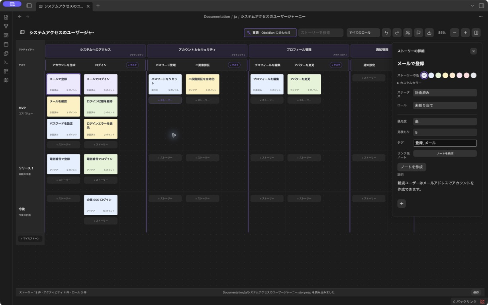
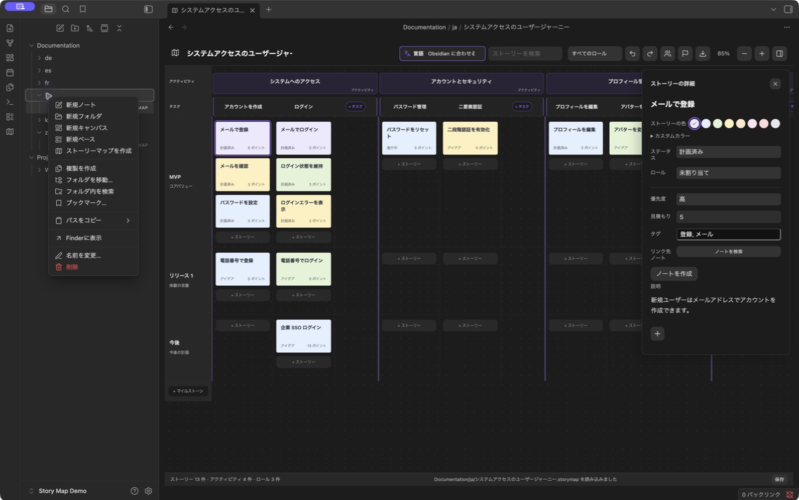
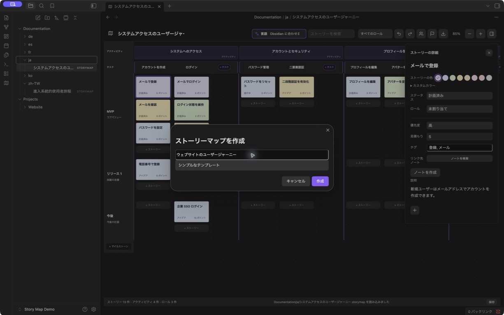

# Obsidian Story Map

[English](README.md) · [简体中文](README.zh-CN.md) · [繁體中文](README.zh-TW.md) · 日本語 · [한국어](README.ko.md) · [Deutsch](README.de.md) · [Français](README.fr.md) · [Español](README.es.md)

**Obsidian で、人とエージェントが同じユーザーストーリーマップを使って計画を立てる。**

ユーザージャーニーを可視化し、アクティビティとタスクに分解して、ユーザーストーリーをリリースのマイルストーンごとに整理します。人は画面上で操作し、保管庫のファイルにアクセスできるエージェントは、プロジェクトのノートとあわせて同じマップを読み書きできます。

**[1.5.1 をダウンロード](https://github.com/prohui/obsidian-story-map/releases/tag/1.5.1)** · [問題を報告](https://github.com/prohui/obsidian-story-map/issues) · [MIT ライセンス](LICENSE)

## Obsidian でストーリーマッピングを行う理由

ユーザーストーリーマッピングは、計画する作業とユーザーの行動を結び付ける手法です。アクティビティとタスクを横方向に並べ、その下のマイルストーンのレーンにストーリーを配置すると、各リリースの対象範囲が見えるようになります。

Obsidian なら、計画を要件、調査、実装のノートと同じ場所に置けます。各マップは JSON を含むローカルの `.storymap` ファイルです。画面とファイル操作に対応したエージェントで同じ計画を扱えるため、別の計画ツールへコピーする必要はありません。

## エージェントとの連携

連携はファイルを通じて行います。自分で用意したエージェントに、必要なマップとノートへのアクセスを許可してください。Story Map は AI エージェント、専用のエージェント API、MCP サーバーを内蔵していません。

1. マップを作成し、ストーリーに関連するノートをリンクします。
2. エージェントにマップとノートを読ませ、抜けているストーリーや受け入れ条件の提案を依頼します。
3. 提案を確認してから、構造、既存の ID、関連付け、無関係な内容を保持してファイルを更新するよう依頼します。
4. Obsidian で結果を確認し、リリース範囲を画面上で調整します。

最初は読み取りだけの依頼にすると確認しやすくなります。

> `Projects/Website/Website journey.storymap` とリンク先の要件ノートを読んで、登録フローに不足しているストーリーと受け入れ条件を提案してください。まだファイルは変更しないでください。

エージェントに渡す前に編集を保存し、同じマップを同時に編集しないでください。開いている `.storymap` が外部で変更された場合、ローカルの変更も開いている詳細エディターもなければ再読み込みします。競合がある場合や詳細エディターが開いている場合は保存を停止し、バックアップして再読み込みする操作を提示します。同時編集の自動マージは行いません。連携には、エージェントがファイルへアクセスし、マップ形式を維持できることが必要です。

## インターフェース

マップで計画を立て、コンパクトなサイドパネルで詳細を編集します。



*Obsidian 1.13.7 と Story Map 1.5.1 の実際の画面です。インターフェースとサンプルデータは日本語で、ファイルサイドバーを非表示にしています。*

- **コンパクトな詳細表示。** 説明欄は内容に合わせて伸びます。ステータス、ロール、優先度、見積もり、タグ、リンク先ノートは追加のプロパティを展開せずに編集できます。
- **ストーリーとタスクの色。** 8 色のプリセット、カラーピッカー、HEX 値に対応。タスクの色はテーマの既定値にも戻せます。
- **見つけやすい言語メニュー。** ツールバーにアイコン、ラベル、現在の選択を表示します。
- **説明と添付ファイル。** ストーリーの説明はシンプルに、タスクとアクティビティは基本的な書式付きで編集できます。添付ファイルは画像サムネイルやファイル名で表示します。

## プロジェクトのフォルダーにマップを作成

1. Obsidian のファイルエクスプローラーでフォルダーを右クリックし、**ストーリーマップを作成**を選びます。



2. 名前を入力し、シンプルなテンプレートまたはサンプルを選んで作成します。選択したフォルダーに独立した `.storymap` ファイルが保存されます。例：`Projects/Website/Website journey.storymap`。ほかのファイルと同じようにエクスプローラーから開けます。



*操作例の画像は日本語のインターフェースを使用したデモ用保管庫で撮影しています。*

旅程の段階をアクティビティに分け、タスクを追加して、マイルストーンのレーンにストーリーを配置します。ストーリーをクリックすると詳細が開き、タスクやアクティビティのタイトルをクリックするとエディターが開きます。ロールとマイルストーンはツールバーで管理します。ストーリーを含むマイルストーンは削除できません。空のタスクとアクティビティは右クリックメニューから削除できます。

## 機能

- アクティビティ → タスク → ストーリーの階層。タスクは列、ストーリーはマイルストーンのレーンに配置。
- 各アクティビティの末尾に専用のタスク追加スペースを用意。
- ストーリーを別のタスクやマイルストーンへドラッグし、別のカードの前に置いて並べ替え。
- ロール、ステータス、優先度、見積もり、タグ、Markdown ノートへのリンク。
- タスクとアクティビティの説明で、見出し、太字、斜体、リスト、チェックリスト、引用、リンク、画像を使用。書式ツールは編集中に表示。
- ストーリー、タスク、アクティビティにコンピューターや保管庫内のファイルを添付。
- 検索、ロールによる絞り込み、ズーム、元に戻す・やり直す、スクロール位置の保持。
- 任意の保管庫フォルダーに複数の独立したマップを作成。旧形式もサポート。
- 英語、簡体字中国語、繁体字中国語、日本語、韓国語、ドイツ語、フランス語、スペイン語に対応。
- PNG、PDF、XMind、JSON の出力、保存状態の表示、失敗時の再試行、読み込み失敗時の上書き防止。

## インストールと更新

Obsidian 1.8.10 以降が必要です。

1. [Releases](https://github.com/prohui/obsidian-story-map/releases/latest) から `main.js`、`manifest.json`、`styles.css` をダウンロードします。
2. 保管庫内の `.obsidian/plugins/story-map/` に配置します。
3. Obsidian の設定 → コミュニティプラグインで **Story Map** を有効にします。
4. リボンのマップアイコンをクリックするか、コマンドパレットで **ストーリーマップを開く**を実行します。

更新時はこの 3 ファイルを置き換えて、プラグインを無効化してから再び有効にします。マップのデータはプラグインのフォルダー外に保存されます。[Obsidian コミュニティページ](https://community.obsidian.md/plugins/story-map)にも掲載されています。

## 説明、色、添付ファイル

**ストーリー：** カードをクリックして詳細を編集します。説明の下の **+** からコンピューターのファイルを取り込むか、保管庫内のファイルを選択できます。色のプリセット、カラーピッカー、HEX 値を利用できます。

**タスクとアクティビティ：** タイトルをクリックし、書式やインライン画像を使って説明を編集します。画像やファイルを貼り付け、ドラッグ、または **+** から追加できます。保存ボタンまたは **Cmd/Ctrl + Enter** で保存します。タスクの色は 8 色のプリセットと任意の HEX 値に対応します。

タスクとアクティビティの添付ファイルは、Obsidian の添付ファイル保存先設定に従ってすぐに書き込まれます。編集のキャンセルや参照の削除では、取り込んだファイルは削除されません。ストーリーの添付ファイルは保存時に書き込まれます。JSON と XMind には参照のみが含まれるため、元の添付ファイルもマップと一緒にバックアップしてください。

## 言語

ツールバーの言語メニューで Obsidian に従う設定か、言語を手動で選択します。変更はすぐに反映され、再読み込み後も保持されます。

切り替わるのは画面のラベルです。既存のタイトル、説明、ロール名などのユーザー入力は翻訳しません。新しいサンプルマップは選択中の言語で作成します。未対応の言語では英語を使用し、繁体字中国語は個別に判定します。

## エクスポート

エクスポートアイコンから形式を選び、システムの保存ダイアログでファイル名と保存先を指定します。

| 形式 | 出力内容 |
| --- | --- |
| PNG | 操作ボタンと詳細パネルを除いた、明るい配色のマップ全体画像。 |
| PDF | マップ全体を 1 ページの画像として保存。文字検索はできません。 |
| XMind | 編集可能なユーザージャーニー、リリース計画、ロールの枝。説明とファイル参照はトピックのノートに保存。 |
| JSON | 説明と添付ファイル参照を含むマップデータのバックアップ。JSON インポート画面は未対応です。 |

検索、絞り込み、ズームは出力範囲を制限しません。画像出力の安全上限を超える大きなマップは XMind または JSON を使用してください。保存ダイアログをキャンセルすると何も書き込みません。システムのダイアログを使えない場合は、保管庫内の `ストーリーマップ出力/` などの言語別フォルダーに保存し、既存ファイルを連番で保護します。失敗した出力は再試行できます。

## データと互換性

- `.storymap` は JSON を含むファイルで、保管庫内の任意の場所に置けます。旧形式の `.story-map.json` と `.story-maps/` もサポートします。
- 説明は Markdown で保存します。リンク先のノートは通常の Markdown ファイルで、プラグインなしでも読めます。
- プラグイン自体はネットワーク通信を行いません。マップ、ノート、添付ファイルをバックアップ対象に含めてください。
- 有効化中にノートやフォルダーの名前を変更すると、マップのリンクと対応する添付ファイル参照を更新します。
- 元に戻す履歴は現在のセッション内で最大 50 ステップです。別の端末で編集する前に同期してください。外部変更は検出しますが、同時編集は自動マージしません。
- 保存に失敗したらプラグインを閉じずに、ディスクや権限の問題を解決して再試行してください。読み込みに失敗したらマップファイルを修復してから再読み込みしてください。

## 開発

Node.js 22 を使用します。

```sh
npm ci
npm test
```

テストには Obsidian の lint 規則、TypeScript、製品ビルド、永続化、言語、色、リッチテキスト、添付ファイル、出力の確認が含まれます。`npm run dev` は変更を監視します。ビルドしたファイルをテスト用保管庫にコピーして実行します。

画面の翻訳は `src/i18n.ts` と `src/locales.ts`、エディターの翻訳は `src/editor-labels.ts` と `src/editor-locales.ts`、サンプルは `src/sample.ts` にあります。英語の `README.md` を基準とし、`README.en.md` と各言語の文書を機能変更に合わせて更新してください。

翻訳や改善への貢献を歓迎します。問題の報告には Obsidian のバージョン、再現手順、個人情報を含まないサンプルを添えてください。

## 開発を支援

Story Map が役立ったら、[Ko-fi で支援](https://ko-fi.com/hexhe)していただけると、保守、不具合修正、改善につながります。支援は任意で、利用できる機能には影響しません。

## ライセンス

[MIT](LICENSE) © 2026 Dahui。Obsidian、Miro、XMind との提携関係はありません。
