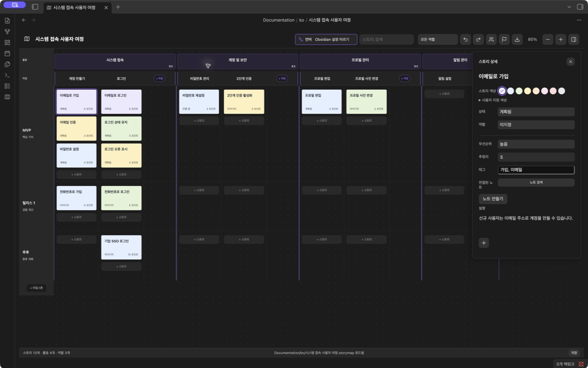
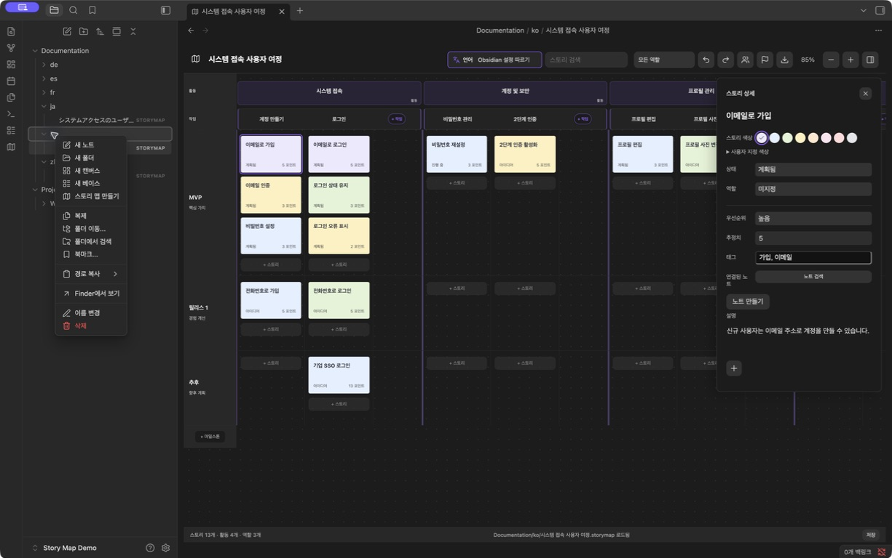
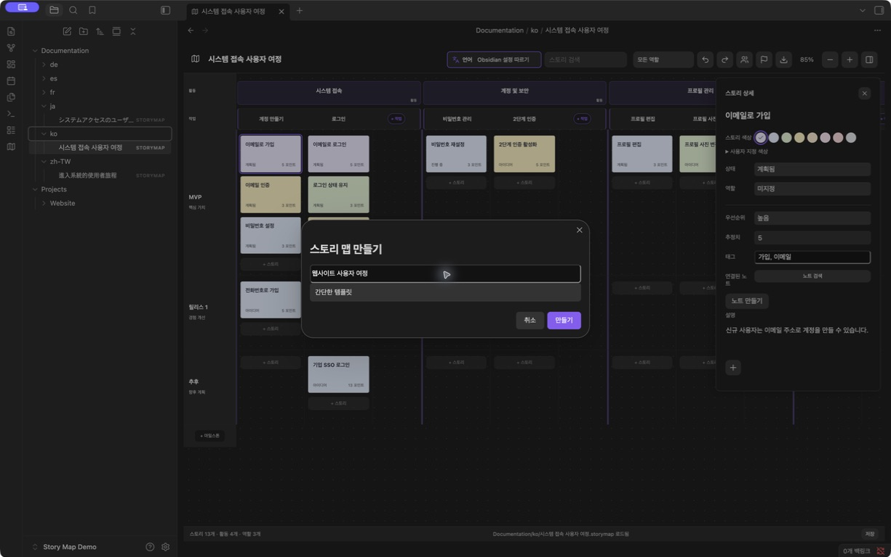

# Obsidian Story Map

[English](README.md) · [简体中文](README.zh-CN.md) · [繁體中文](README.zh-TW.md) · [日本語](README.ja.md) · 한국어 · [Deutsch](README.de.md) · [Français](README.fr.md) · [Español](README.es.md)

**Obsidian에서 사람과 에이전트가 같은 사용자 스토리 맵으로 협업하세요.**

사용자 여정을 시각화하고 활동과 작업으로 나눈 뒤, 사용자 스토리를 릴리스 마일스톤별로 정리하세요. 사람은 화면에서 계획을 편집하고, 보관함 파일에 접근할 수 있는 에이전트는 프로젝트 노트와 함께 같은 맵 파일을 읽고 수정할 수 있습니다.

**[1.5.1 다운로드](https://github.com/prohui/obsidian-story-map/releases/tag/1.5.1)** · [문제 보고](https://github.com/prohui/obsidian-story-map/issues) · [MIT 라이선스](LICENSE)

## Obsidian에서 사용자 스토리 맵을 쓰는 이유

사용자 스토리 매핑은 계획한 작업을 사용자의 여정과 연결합니다. 활동과 작업을 가로로 배치하고 그 아래 마일스톤 레인에 스토리를 놓으면 각 릴리스의 범위를 한눈에 볼 수 있습니다.

Obsidian에서는 요구 사항, 조사 자료, 구현 노트와 같은 공간에 계획을 저장할 수 있습니다. 각 맵은 JSON을 담은 로컬 `.storymap` 파일입니다. 시각적 인터페이스와 파일을 다룰 수 있는 에이전트가 같은 계획을 사용하므로 별도의 계획 도구로 복사할 필요가 없습니다.

## 에이전트와 협업하기

연동은 파일을 통해 이루어집니다. 직접 준비한 에이전트에 관련 맵과 노트의 접근 권한을 부여하세요. Story Map에는 AI 에이전트, 전용 에이전트 API 또는 MCP 서버가 내장되어 있지 않습니다.

1. 맵을 만들고 스토리에 관련 프로젝트 노트를 연결합니다.
2. 에이전트에게 맵과 노트를 읽고 누락된 스토리나 인수 조건을 제안하도록 요청합니다.
3. 제안을 검토한 뒤 파일을 수정하게 하되 구조, 기존 ID, 관계, 무관한 내용을 보존하도록 합니다.
4. Obsidian에서 결과를 확인하고 화면에서 릴리스 범위를 조정합니다.

먼저 읽기 전용 요청으로 시작할 수 있습니다.

> `Projects/Website/Website journey.storymap`과 연결된 요구 사항 노트를 읽고, 가입 여정에서 빠진 스토리와 인수 조건을 제안해 주세요. 아직 파일을 수정하지 마세요.

에이전트에 맡기기 전에 편집 내용을 저장하고 같은 맵을 동시에 수정하지 마세요. 열린 `.storymap` 파일의 외부 변경을 감지하면, 로컬 변경 사항과 열린 상세 편집기가 없을 때 다시 불러옵니다. 충돌이 있거나 상세 편집기가 열려 있으면 저장을 중단하고 백업 후 다시 불러오는 절차를 제공합니다. 동시 편집 내용을 자동으로 병합하지 않습니다. 이 방식은 에이전트의 파일 접근 능력과 맵 형식 보존 능력에 달려 있습니다.

## 인터페이스

맵에서 계획을 정리하고 작은 측면 패널에서 상세 정보를 편집합니다.



*Obsidian 1.13.7과 Story Map 1.5.1의 실제 화면입니다. 인터페이스와 예제 내용 모두 한국어이며, 맵에 집중할 수 있도록 파일 사이드바를 숨겼습니다.*

- **간결한 스토리 상세 정보.** 설명란은 내용에 맞춰 늘어납니다. 상태, 역할, 우선순위, 추정치, 태그, 연결 노트는 추가 속성을 펼치지 않고 편집할 수 있습니다.
- **스토리와 작업 색상.** 기본 8색, 색상 선택기와 HEX 값을 지원합니다. 작업 색상은 테마 기본값으로 되돌릴 수도 있습니다.
- **눈에 잘 띄는 언어 메뉴.** 도구 모음에 아이콘, 이름, 현재 선택한 언어를 표시합니다.
- **간단한 편집과 첨부 파일.** 스토리는 단순한 설명을, 작업과 활동은 기본 서식을 지원합니다. 첨부 파일은 이미지 미리보기나 짧은 파일명으로 표시합니다.

## 프로젝트 폴더에 맵 만들기

1. Obsidian 파일 탐색기에서 대상 폴더를 마우스 오른쪽 버튼으로 클릭하고 **스토리 맵 만들기**를 선택합니다.



2. 이름을 입력하고 간단한 템플릿 또는 예제를 선택하여 만듭니다. 해당 폴더에 독립적인 `.storymap` 파일이 생성됩니다. 예: `Projects/Website/Website journey.storymap`. 다른 파일처럼 탐색기에서 열 수 있습니다.



*작업 예시 이미지는 한국어 인터페이스를 사용하는 데모 보관함에서 촬영했습니다.*

여정의 단계를 활동으로 나누고 작업을 추가한 뒤, 마일스톤 레인에 스토리를 배치하세요. 스토리를 클릭하면 상세 정보가, 작업이나 활동 제목을 클릭하면 편집기가 열립니다. 역할과 마일스톤은 도구 모음에서 관리합니다. 스토리가 있는 마일스톤은 삭제할 수 없으며, 빈 작업과 활동은 오른쪽 클릭 메뉴에서 삭제할 수 있습니다.

## 기능

- 활동 → 작업 → 스토리 구조. 작업은 열로, 스토리는 마일스톤 레인으로 정리합니다.
- 각 활동 끝에 작업 추가 전용 공간을 두어 스토리 열을 좁히지 않습니다.
- 스토리를 다른 작업이나 마일스톤으로 끌어 옮기거나 다른 카드 앞에 놓아 순서를 바꿉니다.
- 역할, 상태, 우선순위, 추정치, 태그를 설정하고 Markdown 노트를 연결합니다.
- 작업과 활동 설명에 제목, 굵게, 기울임, 목록, 체크리스트, 인용, 링크, 이미지를 사용합니다. 서식 도구는 편집할 때 표시됩니다.
- 스토리, 작업, 활동에 컴퓨터 또는 보관함의 파일을 첨부합니다.
- 검색, 역할 필터, 확대·축소, 실행 취소·다시 실행, 스크롤 위치 유지를 지원합니다.
- 보관함 어디에나 여러 독립 맵을 만들 수 있으며 이전 형식도 지원합니다.
- 영어, 중국어 간체·번체, 일본어, 한국어, 독일어, 프랑스어, 스페인어를 지원합니다.
- PNG, PDF, XMind, JSON 내보내기와 저장 상태 표시, 실패 시 재시도, 읽기 실패 시 원본 덮어쓰기 방지를 제공합니다.

## 설치 및 업데이트

Obsidian 1.8.10 이상이 필요합니다.

1. [Releases](https://github.com/prohui/obsidian-story-map/releases/latest)에서 `main.js`, `manifest.json`, `styles.css`를 다운로드합니다.
2. 보관함의 `.obsidian/plugins/story-map/`에 넣습니다.
3. Obsidian 설정의 커뮤니티 플러그인에서 **Story Map**을 활성화합니다.
4. 리본의 맵 아이콘을 클릭하거나 명령 팔레트에서 **스토리 맵 열기**를 실행합니다.

업데이트할 때는 세 파일을 교체한 뒤 플러그인을 껐다가 다시 켭니다. 맵 데이터는 플러그인 폴더 밖에 저장됩니다. [Obsidian 커뮤니티 페이지](https://community.obsidian.md/plugins/story-map)에서도 플러그인을 찾을 수 있습니다.

## 설명, 색상, 첨부 파일

**스토리:** 카드를 클릭하여 상세 정보를 편집합니다. 설명 아래의 **+**로 컴퓨터 파일을 가져오거나 보관함 파일을 선택합니다. 색상 견본 또는 사용자 지정 색상의 선택기와 HEX 입력을 사용할 수 있습니다.

**작업과 활동:** 제목을 클릭하여 서식과 본문 이미지를 포함한 설명을 편집합니다. 이미지와 파일을 붙여 넣거나 끌어 놓거나 **+**로 첨부하세요. 저장 버튼 또는 **Cmd/Ctrl + Enter**로 저장합니다. 작업 색상은 8가지 기본색과 사용자 지정 HEX 값을 지원합니다.

작업과 활동에 가져온 첨부 파일은 Obsidian의 첨부 위치 설정에 따라 즉시 저장됩니다. 편집을 취소하거나 참조를 제거해도 가져온 파일은 삭제되지 않습니다. 스토리에 가져온 파일은 저장 시 기록됩니다. JSON과 XMind는 첨부 파일의 사본이 아닌 참조만 포함하므로 원본 첨부 파일도 맵과 함께 백업하세요.

## 언어

도구 모음의 언어 메뉴에서 Obsidian 언어를 따르거나 직접 언어를 선택합니다. 변경은 즉시 적용되며 다시 불러온 뒤에도 유지됩니다.

언어를 바꾸면 인터페이스 문구만 바뀝니다. 기존 제목, 설명, 역할 이름 등 사용자 내용은 번역하지 않습니다. 새 예제 맵은 선택한 언어로 만들어집니다. 지원하지 않는 Obsidian 언어는 영어로 표시하며, 중국어 번체는 별도로 인식합니다.

## 내보내기

내보내기 아이콘을 누르고 형식을 선택한 뒤, 시스템의 다른 이름으로 저장 대화상자에서 파일명과 위치를 지정합니다.

| 형식 | 결과 |
| --- | --- |
| PNG | 컨트롤과 상세 패널을 제외한 밝은 배경의 전체 맵 이미지. |
| PDF | 전체 맵을 한 페이지 이미지로 저장. 텍스트 검색은 불가능합니다. |
| XMind | 편집 가능한 사용자 여정, 릴리스 계획, 역할 가지. 설명과 파일 참조는 토픽 노트에 포함됩니다. |
| JSON | 설명과 첨부 파일 참조를 포함한 맵 데이터 백업. JSON 가져오기 화면은 아직 없습니다. |

검색, 필터, 확대 비율은 내보내기 범위를 제한하지 않습니다. 이미지 내보내기 안전 한도를 넘는 큰 맵은 XMind 또는 JSON을 사용하세요. 저장 대화상자를 취소하면 파일을 쓰지 않습니다. 시스템 대화상자를 사용할 수 없으면 `스토리 맵 내보내기/` 같은 언어별 보관함 폴더에 저장하며, 번호를 붙여 기존 파일을 보존합니다. 실패하면 재시도할 수 있습니다.

## 데이터 및 호환성

- `.storymap`은 JSON을 포함하며 보관함 어디에나 둘 수 있습니다. 이전의 `.story-map.json`과 `.story-maps/`도 지원합니다.
- 설명은 Markdown으로 저장됩니다. 연결 노트는 일반 Markdown 파일로, 플러그인이 없어도 읽을 수 있습니다.
- 플러그인 자체는 네트워크 요청을 하지 않습니다. 맵, 노트, 첨부 파일을 함께 백업하세요.
- 플러그인이 켜져 있을 때 노트나 폴더 이름을 바꾸면 맵 링크와 지원되는 첨부 참조를 업데이트합니다.
- 실행 취소 기록은 현재 세션에서 최대 50단계까지 유지됩니다. 다른 기기에서 편집하기 전에 동기화하세요. 외부 변경 시 백업 후 다시 불러오기를 지원하지만 동시 편집은 자동 병합하지 않습니다.
- 저장 실패 시 플러그인을 열어 둔 채 디스크나 권한 문제를 해결하고 다시 저장하세요. 읽기 실패 시 맵 파일을 복구한 후 다시 불러오세요.

## 개발

Node.js 22를 사용합니다.

```sh
npm ci
npm test
```

테스트는 Obsidian lint 규칙, TypeScript, 프로덕션 빌드, 데이터 저장, 언어, 색상, 서식 편집, 첨부 파일, 내보내기를 확인합니다. `npm run dev`로 변경을 감시하고, 빌드된 파일을 테스트 보관함에 복사하여 실행합니다.

인터페이스 번역은 `src/i18n.ts`와 `src/locales.ts`, 편집기 번역은 `src/editor-labels.ts`와 `src/editor-locales.ts`, 예제는 `src/sample.ts`에 있습니다. 영어 `README.md`를 기준으로 `README.en.md`와 각 언어 문서를 기능 변경에 맞춰 유지해 주세요.

번역과 개선 기여를 환영합니다. 문제 보고 시 Obsidian 버전, 재현 방법, 개인 정보가 없는 예제를 포함해 주세요.

## 개발 지원

Story Map이 도움이 되었다면 [Ko-fi에서 후원](https://ko-fi.com/hexhe)하여 유지 보수, 버그 수정, 개선을 지원할 수 있습니다. 후원은 선택 사항이며 기능 사용에 영향을 주지 않습니다.

## 라이선스

[MIT](LICENSE) © 2026 Dahui. Obsidian, Miro, XMind와 제휴 관계가 없습니다.
