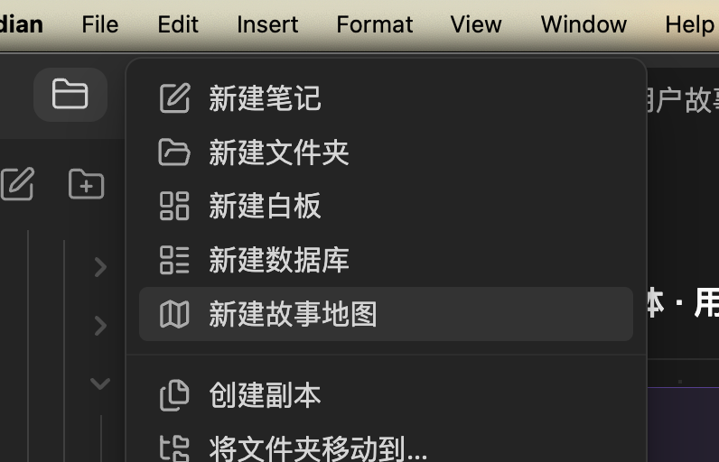
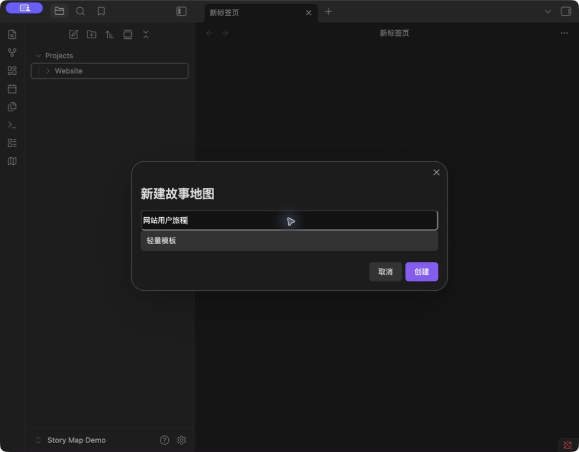

# Obsidian Story Map · 故事地图

[English](README.md) · 简体中文

在 Obsidian 中规划用户旅程、拆分故事和安排发布里程碑。地图可以放在项目笔记旁边，关联参考文件，并导出为 PNG、PDF、XMind 或 JSON。

**[下载 1.5.1](https://github.com/prohui/obsidian-story-map/releases/tag/1.5.1)** · [反馈问题](https://github.com/prohui/obsidian-story-map/issues) · [MIT 许可证](LICENSE)

## 界面与操作

在地图中规划任务，通过紧凑侧栏编辑详情。下图展示当前界面；创建地图的操作步骤见下方。


*Obsidian 1.13.7 实际运行截图，使用示例数据；隐藏文件侧栏以突出地图。*

- **紧凑的 Story 详情。** 描述随文字高度展开，状态、角色、优先级、估点、标签和关联笔记直接显示，无需展开“更多属性”。
- **Story 与 Task 颜色。** 八个小色块提供常用颜色，“自定义颜色”支持取色器与 HEX 色值；Task 也可恢复主题默认颜色。
- **明显的语言入口。** 顶部组合显示语言图标、标签和当前选项，支持跟随 Obsidian 或手动选择八种语言。
- **轻量编辑和附件。** Story 保留简单描述；Task 和 Activity 支持基础富文本。附件以图片缩略图或紧凑文件名显示。

## 在项目文件夹里创建地图

在 Obsidian 文件列表中右键目标文件夹，选择“新建故事地图”，输入名称并选择轻量模板或完整示例。插件会在该文件夹内创建独立 `.storymap` 文件，之后可直接点击文件打开。

**第一步：右键目标文件夹 → 新建故事地图。** 可以在 Vault 任意文件夹创建地图。



**第二步：输入名称，选择轻量模板或完整示例，点击“创建”。** 地图直接保存在所选文件夹中，例如 `Projects/Website/网站用户旅程.storymap`。



*右键菜单为实际操作截图；创建窗口使用示例项目文件夹。*

编辑地图名称，用 Activity 划分用户旅程阶段，为每个 Activity 添加 Task，再按里程碑添加 Story。点击 Story 打开详情，点击 Task 或 Activity 标题打开编辑器。顶部工具栏可以管理角色和里程碑。包含故事的里程碑不能删除；空 Task 和 Activity 可通过右键菜单删除。

## 功能

- Activity → Task → Story 三级结构，任务横向排列，故事按里程碑分组。
- 每个 Activity 末尾预留独立的添加 Task 空间，不挤占故事列。
- 拖拽故事到其他任务、里程碑或另一张故事卡前，调整顺序与发布范围。
- 分配角色、设置状态和优先级、填写估点和标签、关联 Markdown 笔记。
- Task / Activity 正文支持标题、粗体、斜体、列表、待办、引用、链接和图片；编辑时显示格式工具。
- Story、Task 和 Activity 均可添加电脑文件或库内文件作为附件。
- 搜索、角色筛选、缩放、撤销和重做，编辑后保留画布滚动位置。
- 在 Vault 任意文件夹创建独立 `.storymap` 文件，支持多张地图，兼容旧格式。
- 支持英语、简体中文、繁体中文、日语、韩语、德语、法语和西班牙语。
- 导出 PNG、PDF、XMind 和 JSON；显示保存状态，失败可重试，读取失败时保护原始数据。

## 安装与更新

需要 Obsidian 1.8.10 或更新版本。

1. 从 [Releases](https://github.com/prohui/obsidian-story-map/releases/latest) 下载 `main.js`、`manifest.json` 和 `styles.css`。
2. 将三个文件放入 Vault 内的 `.obsidian/plugins/story-map/`。
3. 在 Obsidian → 设置 → 第三方插件中启用 **Story Map**。
4. 点击左侧地图图标，或在命令面板执行“打开故事地图”。

更新时替换上述三个文件，再禁用并重新启用插件。地图数据保存在插件目录之外。[Obsidian 社区页面](https://community.obsidian.md/plugins/story-map)提供社区插件入口。

## 描述、颜色与附件

**Story：** 点击卡片即可编辑紧凑详情。描述下方的 **+** 可以导入电脑文件或选择库内文件。“故事颜色”提供小色块，展开“自定义颜色”后可使用取色器或输入 HEX 色值。

**Task / Activity：** 点击标题打开描述编辑器，用基础格式和正文图片说明任务及参考内容。可粘贴、拖入图片和文件，也可通过 **+** 添加附件。点击“保存”，或按 **Cmd/Ctrl + Enter** 保存。Task 编辑器提供任务颜色，支持八种预设与自定义 HEX 颜色。

Task / Activity 导入的附件会按 Obsidian 的附件位置设置立即保存到库内，取消编辑或移除关联不会删除已导入文件。Story 导入的文件在保存时写入。请把附件与地图一起备份：JSON 和 XMind 导出保留引用，不打包附件原文件。

## 多语言

通过顶部语言菜单切换；菜单带有图标和常显的“语言”标签，便于查找。可选择“跟随 Obsidian”，也可手动指定语言，选择后立即生效并保存。

切换语言只改变界面文字，已有标题、描述、角色名称和其他用户内容保留原文。新建示例地图使用当前语言。未支持的 Obsidian 语言回退为英文，繁体中文单独识别。

## 导出

点击导出图标，选择格式，再通过系统“另存为”选择文件名和位置。

| 格式 | 导出内容 |
| --- | --- |
| PNG | 完整地图的浅色图片，不包含工具栏和详情面板。 |
| PDF | 单页完整地图图片，文字不可搜索。 |
| XMind | 可编辑的“用户旅程 / 发布计划 / 角色”分支，描述和文件引用保存在主题备注中。 |
| JSON | 地图数据备份，包含描述和附件引用；暂未提供 JSON 导入界面。 |

搜索、筛选与缩放不会限制导出范围。超出图片安全尺寸的大地图可使用 XMind 或 JSON。取消“另存为”不会写入文件。不支持系统窗口时，导出到库内对应语言的文件夹，例如 `故事地图导出/`，并自动编号以保留已有文件。导出失败可重试。

## 数据与兼容性

- 每张 `.storymap` 地图保存为 JSON 内容，可放在 Vault 任意位置。继续支持旧版 `.story-map.json` 和 `.story-maps/` 地图。
- 描述以 Markdown 保存；关联笔记是普通 Markdown 文件，停用插件后仍可读取。
- 插件自身不发起网络请求。请将地图、笔记和附件一起纳入 Vault 备份。
- 插件启用期间，笔记或文件夹改名会更新地图关联及支持的附件引用。
- 撤销历史保留在当前会话，最多 50 步。多端编辑前请先同步。独立地图支持外部修改检测和“备份并重新加载”，不自动合并同时编辑的内容。
- 保存失败时保持插件开启，排除磁盘或权限问题后重试。读取失败时先修复地图文件，再重新加载。

## 开发

使用 Node.js 22：

```sh
npm ci
npm test
```

测试覆盖 Obsidian 规范检查、TypeScript 检查、生产构建、持久化、多语言、颜色、富文本、附件和导出。`npm run dev` 启动构建监听；将构建后的插件文件复制到测试 Vault 即可运行。

界面翻译位于 `src/i18n.ts` 和 `src/locales.ts`，编辑器翻译位于 `src/editor-labels.ts` 和 `src/editor-locales.ts`，示例内容单独在 `src/sample.ts` 中翻译。英文 `README.md` 与 `README.en.md` 保持同步。

欢迎提交翻译和功能改进。反馈问题时请附 Obsidian 版本、复现步骤和不含私人数据的示例。

## 许可证

[MIT](LICENSE) © 2026 Dahui。本项目与 Obsidian、Miro、XMind 无隶属关系。
