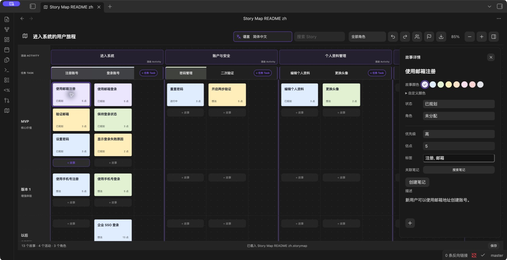

# Obsidian Story Map · 故事地图

[English](README.md) · 简体中文

在 Obsidian 中规划用户旅程、拆分用户故事和安排发布里程碑。地图保存在你的 Vault 中，故事卡可以关联 Markdown 笔记，也可以导出为 XMind 脑图。

**[下载 1.2.0](https://github.com/prohui/obsidian-story-map/releases/tag/1.2.0)** · [反馈问题](https://github.com/prohui/obsidian-story-map/issues) · [MIT 许可证](LICENSE)



*Obsidian 1.13.7 实际运行截图，使用示例数据。*

## 功能

- Activity → Task → Story 三级结构，Task 横向排列，Story 按里程碑纵向堆叠。
- 在末尾添加 Activity、Task，在已有故事下方添加 Story；双击名称或故事卡编辑。
- 添加、编辑和删除角色，每个 Story 可以分配一个角色，也可暂不分配。
- 里程碑可添加、编辑和删除；包含 Story 时禁止删除。空 Task 和 Activity 可通过右键菜单删除。
- 拖拽故事到其他任务、里程碑或另一张故事卡前。
- 右侧浮动详情：状态、优先级、估点、标签、描述和关联笔记。
- 搜索、角色筛选、画布缩放、撤销和重做；编辑后保留画布滚动位置。
- 支持英语、简体中文、繁体中文、日语、韩语、德语、法语和西班牙语，默认跟随 Obsidian，也可手动切换。
- 导出窗口支持 PNG、PDF、XMind 和 JSON。XMind 按“用户旅程 / 发布计划 / 角色”组织脑图，故事详情保存在主题备注中。
- 本地自动保存，显示保存状态，失败可重试；读取失败时暂停写入保护原文件。

## 安装

需要 Obsidian 1.8.10 或更新版本。

1. 从 [Releases](https://github.com/prohui/obsidian-story-map/releases/latest) 分别下载 `main.js`、`manifest.json` 和 `styles.css`。
2. 在 Vault 中创建 `.obsidian/plugins/story-map/`，放入上述三个文件。
3. 在 Obsidian → 设置 → 第三方插件中启用“Story Map”。
4. 点击左侧地图图标，或执行打开故事地图的命令。

更新时替换上述三个文件，再禁用并重新启用插件。地图数据保存在插件目录之外。也可访问 [Obsidian 社区页面](https://community.obsidian.md/plugins/story-map)，查看当前审核状态与安装入口。

## 使用与语言

编辑顶部地图名称，用 Activity 划分用户旅程阶段，为每个 Activity 添加 Task，再按里程碑添加 Story。点击故事卡编辑详情，通过角色管理维护角色，然后将角色分配给故事。拖拽故事调整顺序或发布范围。

顶部语言菜单提供“跟随 Obsidian”与八种语言，选择立即生效并保存。未支持的语言回退为英文，繁体中文单独识别。按钮、弹窗、提示和导出字段随语言切换；已有故事标题、角色名称和其他用户内容保持原文。首次使用或主动重置示例地图时，示例内容按当前语言生成。

点击导出箭头后，先在弹窗选择格式，再确认导出。PNG 为完整地图图片；PDF 为单页图片式文件（文字不可搜索）；XMind 为可编辑脑图；JSON 为完整数据备份（暂未提供导入界面）。PNG/PDF 使用独立的浅色排版，包含全部活动、任务、里程碑和故事卡，不包含工具栏和详情面板。搜索、筛选与缩放不会限制导出内容。超出图片安全尺寸的大地图需使用 XMind 或 JSON。

中文界面导出到库内 `故事地图导出/`，英文界面导出到 `Story Map Exports/`；已有文件自动编号保留。导出失败会在弹窗提示，可重试。

## 数据与兼容性

- 每个 Vault 使用一张地图，保存在根目录 `.story-map.json`，请纳入 Vault 备份。
- 插件自身不联网。关联笔记为普通 Markdown 文件，停用插件后仍可读取。
- 撤销历史保留在当前会话，最多 50 步。多端使用请先同步再编辑；不提供同时编辑的冲突合并。
- 保存失败时请保持插件开启，排除磁盘或权限问题后点击底部“保存”。读取失败时请修复文件后重新加载插件。
- 发布验收环境：macOS、Obsidian 1.8.10、XMind 26.04.01337。已检查桌面和窄面板、中英文界面、核心编辑操作、持久化与 XMind 打开；XMind 保存后重开也已实测。

## 开发

使用 Node.js 22：

```sh
npm ci
npm test
```

`npm test` 执行 Obsidian 官方规范检查、TypeScript 检查、生产构建和回归测试。`npm run lint` 可单独运行规范检查，`npm run dev` 启动构建监听。将构建后的三个插件文件复制到测试 Vault 即可运行。

翻译集中在 `src/i18n.ts`，通过占位符插入动态值，避免改写用户内容。欢迎提交翻译或功能改进。反馈问题时请附 Obsidian 版本、操作步骤和不含私人数据的示例。

## 许可证

[MIT](LICENSE) © 2026 Dahui。本项目与 Obsidian、Miro、XMind 无隶属关系。
