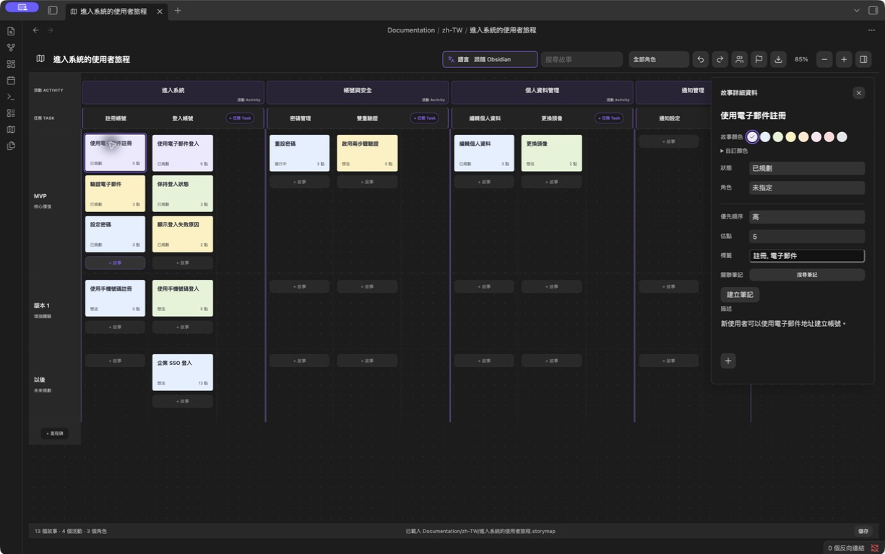
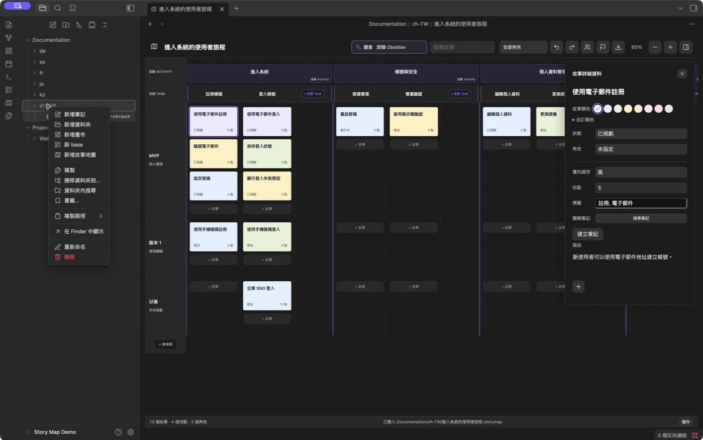
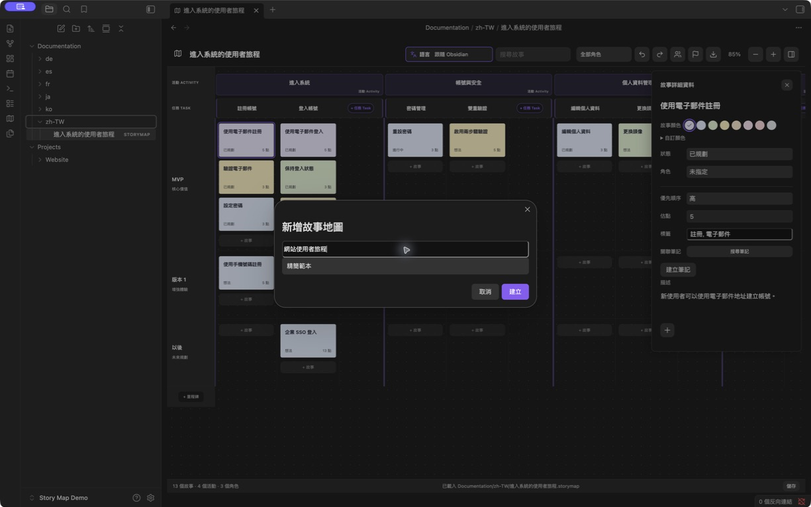

# Obsidian Story Map · 故事地圖

[English](README.md) · [简体中文](README.zh-CN.md) · 繁體中文 · [日本語](README.ja.md) · [한국어](README.ko.md) · [Deutsch](README.de.md) · [Français](README.fr.md) · [Español](README.es.md)

**在 Obsidian 中，讓人與 agent 圍繞同一份使用者故事地圖協作。**

以 User Story Mapping（使用者故事地圖）規劃產品：梳理使用者旅程，拆分活動與任務，再按發布里程碑組織使用者故事。人透過視覺化介面規劃，取得 Vault 檔案存取權限的 agent 則可結合專案筆記，讀取與編輯同一份地圖檔案。

**[下載 1.5.1](https://github.com/prohui/obsidian-story-map/releases/tag/1.5.1)** · [回報問題](https://github.com/prohui/obsidian-story-map/issues) · [MIT 授權條款](LICENSE)

## 為什麼在 Obsidian 使用故事地圖？

使用者故事地圖將計畫中的工作與使用者旅程連結：Activity（活動）與 Task（任務）橫向展開，Story（故事）放在對應任務下，按里程碑泳道劃分每個版本的交付範圍。

在 Obsidian 中，產品規劃、需求、研究與實作筆記可以放在同一個工作空間。每張地圖都是包含 JSON 的本機 `.storymap` 檔案。視覺化介面與能讀寫檔案的 agent 共用同一份規劃，無須再複製到其他規劃工具。

## 與 agent 協作

目前透過檔案協作。請使用自己的 agent，並授予相關地圖與筆記的存取權限。Story Map 本身不內建 AI agent、專用 agent API 或 MCP 伺服器。

1. 建立地圖，為故事連結相關專案筆記。
2. 請 agent 讀取地圖與筆記，找出遺漏，提出故事或驗收條件建議。
3. 審閱建議後，讓 agent 更新檔案，保留結構、既有 ID、關聯與無關內容。
4. 回到 Obsidian 檢查結果，透過地圖調整發布範圍。

可以先提出唯讀要求：

> 讀取 `Projects/Website/Website journey.storymap` 及其連結的需求筆記，找出註冊流程中遺漏的故事，並提出驗收條件。先不要修改任何檔案。

交給 agent 前先儲存編輯，避免同時修改同一張地圖。外部修改了已開啟的 `.storymap` 檔案時，若沒有本機變更，也沒有開啟的詳細資料編輯器，外掛會重新載入。若有衝突或編輯器仍開啟，則停止儲存並提供「備份並重新載入」，不會自動合併同時進行的編輯。此流程取決於 agent 的檔案存取能力，以及能否正確保留地圖格式。

## 介面

在地圖上規劃，透過精簡側欄編輯詳細資料。



*Obsidian 1.13.7 與 Story Map 1.5.1 的實際執行截圖，介面與範例內容均為繁體中文；隱藏檔案側欄以凸顯地圖。*

- **精簡的故事詳細資料。** 描述隨文字高度展開；狀態、角色、優先順序、估點、標籤與關聯筆記直接顯示，無須展開更多屬性。
- **故事與任務顏色。** 八種預設色塊與自訂取色器、HEX 色碼；任務也可還原為佈景主題預設色。
- **明確的語言入口。** 工具列顯示語言圖示、標籤與目前選項，可跟隨 Obsidian 或手動選擇八種語言。
- **輕量編輯與附件。** 故事使用簡單描述，任務與活動支援基本格式；附件以圖片縮圖或精簡檔名顯示。

## 在專案資料夾建立地圖

1. 在 Obsidian 檔案總管中，於目標資料夾按右鍵，選擇「新增故事地圖」。



2. 輸入名稱，選擇精簡範本或範例，然後建立。地圖會儲存為該資料夾中的獨立 `.storymap` 檔案，例如 `Projects/Website/Website journey.storymap`，可直接從檔案總管開啟。



*操作截圖使用繁體中文介面與示範 Vault。*

以活動劃分旅程階段，將活動拆成任務，再把故事放入里程碑泳道。點擊故事開啟詳細資料；點擊任務或活動標題開啟編輯器。從工具列管理角色與里程碑。包含故事的里程碑無法刪除；空的任務與活動可透過右鍵選單刪除。

## 功能

- Activity → Task → Story 三層結構，任務橫向排列，故事按里程碑分組。
- 每個活動末尾保留新增任務的獨立空間，不擠壓故事欄。
- 拖曳故事到其他任務、里程碑或另一張卡片前，調整順序與發布範圍。
- 指定角色、狀態、優先順序、估點與標籤，連結 Markdown 筆記。
- 任務與活動描述支援標題、粗體、斜體、清單、待辦、引言、連結與圖片；編輯時顯示格式工具。
- 故事、任務與活動皆可加入電腦或 Vault 中的檔案作為附件。
- 搜尋、角色篩選、縮放、復原與重做，並保留捲動位置。
- 在 Vault 任意資料夾建立多張獨立地圖，並相容舊格式。
- 支援英文、簡體中文、繁體中文、日文、韓文、德文、法文與西班牙文。
- 匯出 PNG、PDF、XMind 與 JSON；提供儲存狀態、失敗重試及讀取失敗時的原始資料保護。

## 安裝與更新

需要 Obsidian 1.8.10 或更新版本。

1. 從 [Releases](https://github.com/prohui/obsidian-story-map/releases/latest) 下載 `main.js`、`manifest.json` 與 `styles.css`。
2. 將三個檔案放入 Vault 的 `.obsidian/plugins/story-map/`。
3. 在 Obsidian 設定的社群外掛頁面啟用 **Story Map**。
4. 點擊地圖圖示，或在命令面板執行「開啟故事地圖」。

更新時替換這三個檔案，再停用並重新啟用外掛。地圖資料保存在外掛資料夾之外。[Obsidian 社群頁面](https://community.obsidian.md/plugins/story-map)提供外掛目錄入口。

## 描述、顏色與附件

**故事：** 點擊卡片編輯詳細資料。描述下方的 **+** 可匯入電腦檔案或選擇 Vault 內檔案。使用故事色塊，或展開自訂顏色以使用取色器與 HEX 色碼。

**任務與活動：** 點擊標題編輯描述，可貼上、拖入圖片與檔案，或用 **+** 加入附件。點擊儲存，或按 **Cmd/Ctrl + Enter**。任務編輯器提供八種預設色與自訂 HEX 色碼。

任務與活動匯入的附件會依 Obsidian 附件位置設定立即寫入 Vault；取消編輯或移除引用不會刪除已匯入檔案。故事匯入的檔案在儲存時寫入。請將附件與地圖一起備份：JSON 與 XMind 匯出只保留引用，不包含附件原始檔案。

## 語言

透過工具列的語言選單選擇跟隨 Obsidian 或手動指定語言，立即生效並保留設定。

切換語言只改變介面文字，不翻譯既有標題、描述、角色名稱或其他使用者內容。新建範例地圖使用目前語言。未支援的 Obsidian 語言會回退為英文；繁體中文會獨立辨識。

## 匯出

點擊匯出圖示、選擇格式，再透過系統「另存新檔」視窗選擇檔名與位置。

| 格式 | 匯出內容 |
| --- | --- |
| PNG | 完整地圖的淺色圖片，不含控制項與詳細資料面板。 |
| PDF | 單頁完整地圖圖片，文字無法搜尋。 |
| XMind | 可編輯的使用者旅程、發布計畫與角色分支，描述與檔案引用保存在主題備註中。 |
| JSON | 地圖資料備份，包含描述與附件引用；尚未提供 JSON 匯入介面。 |

搜尋、篩選與縮放不限制匯出範圍。超出圖片匯出安全限制的大型地圖可使用 XMind 或 JSON。取消另存新檔不會寫入任何檔案。系統視窗不可用時，會匯出到 Vault 內對應語言的資料夾，例如 `故事地圖匯出/`，並以編號保留現有檔案。匯出失敗可重試。

## 資料與相容性

- `.storymap` 檔案包含 JSON，可放在 Vault 任意位置。繼續支援舊版 `.story-map.json` 與 `.story-maps/` 地圖。
- 描述以 Markdown 儲存。關聯筆記是一般 Markdown 檔案，停用外掛後仍可讀取。
- 外掛本身不發起網路請求。請將地圖、筆記與附件一起納入備份。
- 外掛啟用時，筆記或資料夾重新命名會更新地圖連結及支援的附件引用。
- 復原歷史僅保留於目前工作階段，最多 50 步。跨裝置編輯前請先同步。外部修改可透過備份並重新載入處理，不會自動合併同時編輯的內容。
- 儲存失敗時保持外掛開啟，排除磁碟或權限問題後重試。讀取失敗時先修復地圖檔案，再重新載入。

## 開發

使用 Node.js 22：

```sh
npm ci
npm test
```

測試涵蓋 Obsidian 規範、TypeScript、生產建置、持久化、多語言、顏色、富文字、附件與匯出。`npm run dev` 監看變更；將建置後的外掛檔案複製到測試 Vault 即可執行。

介面翻譯位於 `src/i18n.ts` 與 `src/locales.ts`，編輯器翻譯位於 `src/editor-labels.ts` 與 `src/editor-locales.ts`，範例內容位於 `src/sample.ts`。英文 `README.md` 為文件基準，`README.en.md` 與其保持一致；功能變更時請同步更新各語言文件。

歡迎提交翻譯與改進。回報問題時，請附上 Obsidian 版本、重現步驟與不含私人資料的範例。

## 支持開發

如果 Story Map 對你有幫助，歡迎[透過 Ko-fi 支持開發](https://ko-fi.com/hexhe)，協助持續維護、修復問題與改善體驗。支持完全自願，不影響任何功能的使用。

## 授權條款

[MIT](LICENSE) © 2026 Dahui。本專案與 Obsidian、Miro、XMind 無隸屬關係。
